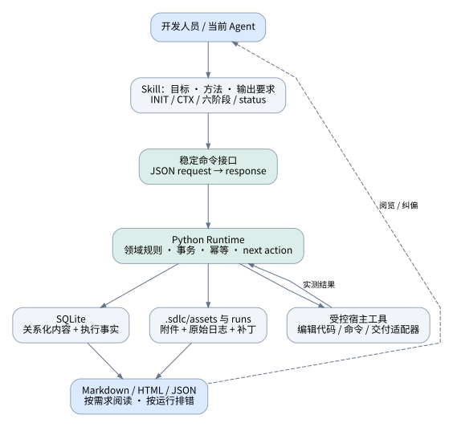
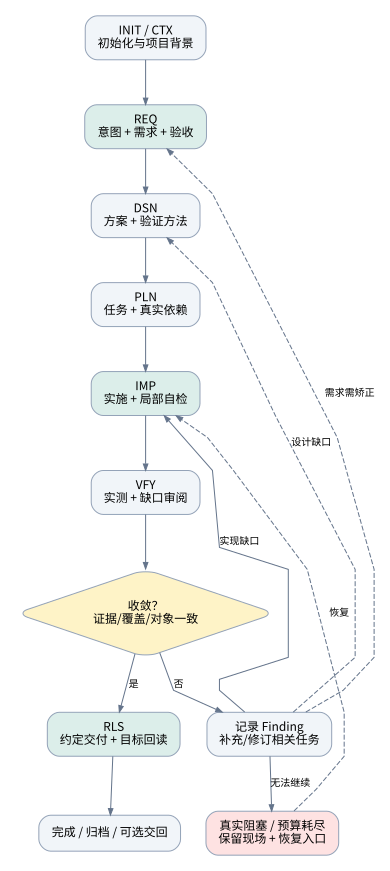
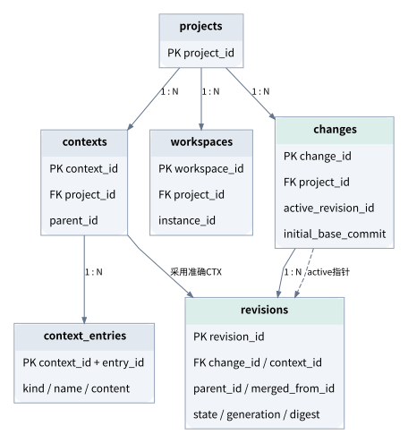
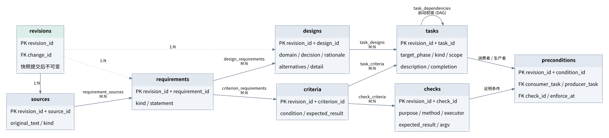
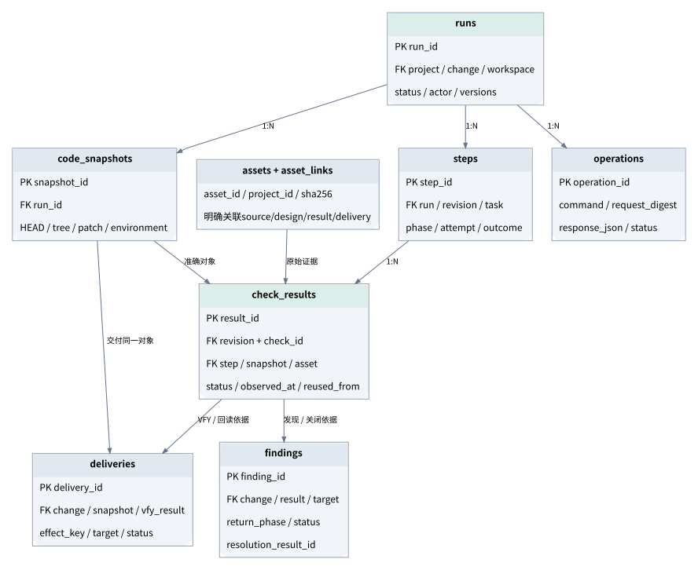
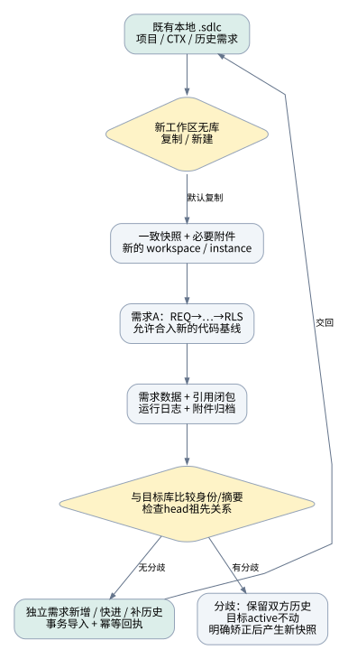

# SDLC v2：结构化自动执行内核

**详细设计草案 · 2026-09-09 · 待设计确认**  
审查基线：`ousui/sdlc-ai-spec@f25ed518f662c0ac7306c94f845297f5642c44b2`。  
交付边界：设计、数据模型、接口示例及模型验证；尚未修改仓库、替换规范、删除旧测试或实现新 Runtime。

## 00｜先决定：直接用 Spec Kit，还是继续自研？

> **本章速读：只为“描述需求后让 AI 完成实现”，直接使用 Spec Kit 是合理且成本更低的选择。自研仅承担一个差异：把六阶段变成可查询、可校验、可移交的领域数据系统。自动循环、跨 Agent、日志和恢复本身都不是独有优势。**

### 0.1 对产品价值的重新判断

当前 Spec Kit 已有规格、计划、任务、实现、converge 和既有项目接入；Workflow 还支持循环、状态、日志及恢复。[S01](#source-S01)[S02](#source-S02)[S03](#source-S03) 因此，本项目不能再以“Spec Kit 不支持老项目”“没有执行机制”“不能连续执行”论证自研必要性。

你的最初目标，以本会话中你反复确认的表述为准：**让开发者更容易、稳定地使用 AI，而不是先学会管理一套复杂规范。** 补充历史检索没有找回最早会话全文；附件《Agent 插件开发指南》是当时的工程约束交接材料，不被当作用户原始动机的独立证明。[U01](#source-U01)

| 对比项 | 直接采用 Spec Kit | 本设计预期的不同体验 |
|---|---|---|
| 一个想法到实现 | 已有完整流程 | 沿用成熟方法，不重新发明 |
| implement/converge 循环 | 已有 | 在结果数据库中显式记录缺口、覆盖、复验和收敛 |
| 使用多个 Agent | 已有接入 | 同一套领域命令、字段和错误语义；切换宿主不重建关系 |
| 进度与恢复 | 已有 Workflow 状态与日志 | 查询到验收条件/工作项/真实执行证据，而不只是执行到哪条命令 |
| 本地数据持久化 | 默认产物文件＋运行记录 | SQLite 保存业务对象；阅读文件可重建 |
| worktree 工作回收 | 根据现有工具组织 | 按需求身份与内容快照做小范围导入，复制不覆盖主库 |
| 平台化 | 可扩展 | 本地模式先验证领域模型，将来沿用接口接中心库 |
| 实际质量和耗时 | 需要实测 | 也是待验证假设，不保证因换数据库而提高 |

**建议选型：Spec Kit 方法资产＋独立的薄领域内核；正式入口仍是当前六个 Skill。** 第一版本复用澄清、设计、任务拆解与缺口检查的方法，不同时建设完整 Preset、Extension、MCP、Web 服务四套入口。稳定的 CLI JSON 接口提供后续适配点。

第一轮试用允许以原生 Spec Kit 作为对照。若自研在“流程故障次数、换会话恢复、验收证据完整度、人工操作量”上没有实质收益，应保留可复用 Skill，停止扩大 Runtime。这个判断与本次设计交付并不冲突。

### 0.2 三个明确的首版取舍

**本地 Python、SQLite、固定六阶段。** 数据表支持多个项目和需求，但首版部署是本地插件；跨工作副本采用显式复制/交回。

**默认自动审阅模式。** 人可以随时修正，但没有逐阶段人工签字前置。授权范围、缺失关键事实、真实环境不可用等情况才产生具体阻塞。

**关系化数据权威。** 程序读取字段与外键；自然语言放在明确字段；模板只负责展示。保留 Spec Kit 的使用逻辑，不保留现有 Canonical Markdown 解析链。

### 0.3 上游参考与本项目政策分开

Anthropic playbook强调把阶段变成有反馈的循环，并把控制落在执行过程；文中仍保留人的业务责任和关键确认，并以版本化产物串联流程。本设计的“默认无需逐阶段人工review、过程数据不入VCS”是你明确选择的运行政策，不被表述成该文章的原样要求。[S09](#source-S09)

实际复用Spec Kit模板时，记录上游版本、原文件和本地修改，按其许可保留相应版权说明。可使用Preset机制适配既有用户，但首版正式交付先保持一个原生插件入口和一套Runtime。[S04](#source-S04)[S22](#source-S22)

## 01｜目标、成功标准与复杂度边界

> **本章速读：用户只需要说清目标并依次调用 Skill，或一次授权六阶段连续执行。系统替用户管理引用、版本、证据和恢复。首版是一个小型本地软件系统，不是通用工作流平台。**

### 1.1 默认用户旅程

```text
项目首次：sdlc-init → sdlc-000-ctx
每个需求：REQ → DSN → PLN → IMP → VFY → RLS
                                   ↑     │
                                   └─────┘ 发现实现缺口后自动复验
```

阶段命名沿用 `IMP`。用户本轮的 `iml` 按已确认的 Implementation 阶段理解。

用户可以逐个调用 `sdlc-100-req`、`sdlc-200-dsn`、`sdlc-300-pln`、`sdlc-400-imp`、`sdlc-500-vfy`、`sdlc-600-rls`，也可以发送一个总提示词，由当前 Agent 在当前宿主中依次执行。Runtime 保存 next action，但不自行购买模型、创建后台 Agent 或要求额外 API Key。

**默认总提示词契约示例：**

```text
在当前项目完成这个已澄清需求：<目标、验收、范围>。
依次执行 REQ → DSN → PLN → IMP → VFY → RLS。
使用 auto 模式；自动完成阶段分析和检查，并修复本范围内缺口，直到验证收敛。
授权当前工作区的产品编辑、必要本地检查及本地交付包生成。
按既有项目规则选择实现方式；保留全部过程记录于 .sdlc。
最终交付目标：本地可用结果及交付报告。
```

这表示没有额外人工 review 也可跑完本地链路；目标明确为远端 PR、主干合并或部署时，授权和能力应在开始时一并给定。RLS 对约定目标负责，不能将尚未完成的部署悄悄改名为本地归档。

### 1.2 成功的可观察定义

完整运行应同时满足：原始意图可追溯；每条需求有验收；设计与任务覆盖可查询；实际代码对象明确；必要检查有证据；缺口已复验关闭；约定目标交付有回读。机器只保证记录与规则的一致性，不保证模型的业务判断绝对正确。

首版默认顺序执行同一工作区的写操作。不同 worktree 可以各自运行。只有运行数据证明需要更强并发时才增加调度能力。

### 1.3 本轮设计范围

实现范围为：初始化与 CTX、六阶段领域操作、自动反馈循环、32 张本地关系表、诊断和附件、阅读视图、本地复制/交回、规范替换、新测试集和三宿主入口验证。

后续能力只保留接口说明：Rust 重写、MySQL 服务、团队身份认证、远端文件存储。数据库的 project_id 与稳定 ID 为后续演进保留必要空间。

## 02｜总体架构与责任边界

> **本章速读：Skill 负责“怎么思考和做事”，Runtime 负责“如何合法地保存和推进”，数据库保存业务事实，宿主工具实际修改代码和执行命令。只有一套领域规则。**



| 层 | 首版组成 | 输入／输出 |
|---|---|---|
| 宿主适配 | Codex、Cursor、Claude Code 的打包入口 | 使用当前 Agent 和宿主工具 |
| Skill | INIT、CTX、六阶段、status；共享连续执行说明 | 本阶段目标、输入包、领域命令、next action |
| 应用服务 | 命令分发、事务、幂等、执行记录、导入导出 | 版本化 JSON 请求/响应 |
| 领域模块 | requirements / design / planning / execution / verification / delivery | 共享实体、校验器、状态规则 |
| 基础设施 | SQLite、附件文件、Git 观察、受控命令收集、模板渲染 | 数据、日志、代码快照、阅读结果 |

代码写入、命令执行和远端操作都发生在当前宿主的实际能力边界内。Runtime 提供执行包装器收集 stdout、stderr、退出码及准确对象；模型文本“执行成功”不能替代包装器结果。

### 2.1 固定步骤，不引入流程 DSL

每个阶段在打包代码中维护少量固定步骤。Runtime 返回下一步骤和字段要求，Skill 指导模型执行。第一版本没有用户自定义图执行引擎、复杂规则表达式或后台调度器。

### 2.2 四种结论必须分开

| 结论 | 产生者 | 含义 |
|---|---|---|
| 数据校验通过 | Runtime | 字段、引用、范围、覆盖、必要记录合法 |
| AI 审阅通过 | 当前 Agent 或真实独立 Reviewer | 对业务/实现提出的审阅结论，有所检查范围和依据 |
| 检查执行通过 | 执行收集器＋结果判定 | 指定命令/方法对准确对象得到通过结果 |
| 人工授权/矫正 | 真实用户或已配置政策 | 允许哪些动作，或改变哪些业务决定 |

auto 模式记录 `review_mode=auto` 及实际 actor。没有独立执行者时按自审记录，不伪造 independent reviewer，更不生成虚假的人工签名。

### 2.3 Python 工程落点

```text
packages/sdlc/
  domain/        # 纯领域对象、校验、状态与覆盖规则
  services/      # 用例编排、事务、幂等与恢复
  storage/       # SQLite SQL、事务、附件管理
  adapters/      # Git、命令收集、宿主调用桥接
  rendering/     # Markdown / HTML 模板
  cli.py         # 唯一 CLI JSON 入口
contracts/       # JSON Schema、枚举与行为规范
skills/          # INIT / CTX / 六阶段 / status
```

模块数量由职责决定；领域代码不依赖宿主私有路径，宿主适配不包含第二份业务校验器。

## 03｜自动推进、收敛与停止规则

> **本章速读：阶段提交自动校验后可以立即进入下一阶段；VFY 把缺口变成任务并复验。只有真实未满足条件阻塞具体动作，而不是因为没有人工点击“确认”。**



### 3.1 阶段完成规则

`phase.complete` 执行：检查当前草稿 → 检查本阶段覆盖与必要产物 → 计算逻辑摘要 → 提交关系快照 → 记录 step 结果 → 推进当前指针 → 返回 next action。一次数据库事务完成需要一致的状态变化。

人工审阅是 `assisted` 模式的可选暂停点；auto 使用同样的数据和检查规则，只是不等待审阅按钮。不能把缺少实际验收证据转成 auto approval。

### 3.2 三类循环

**格式循环：** 缺字段、引用不存在等在本次提交处返回字段路径，AI 修改同一草稿。

**实施循环：** VFY 发现 missing/partial/contradicts，创建或复用 finding，补充相关任务，回到 IMP，再复验。

**语义循环：** 设计缺口回 DSN；任务遗漏回 PLN；需求矛盾回 REQ。只更新受影响对象；范围和验收标准的实质改变需要来源用户的新指令或预先批准的政策，不能为了收敛降低验收。

### 3.3 Converged 的定义

```text
本次范围的必要验收均有适用检查
AND 必要检查已执行且结果满足要求
AND 结果绑定当前采用的内容/代码/环境
AND blocking finding 均经复验关闭
AND 没有待执行的必要任务
AND 没有阻塞性未知或冲突
```

自然语言 Converged 只是模型建议；最终结论由 Runtime 根据保存的结果和结构关系计算。Inspection/Analysis 本来就可能是 AI 判断，应当标出证据性质，不将其伪装为真实端到端测试。

**默认循环预算：** 内容格式修复每次提交最多 3 次；完整 IMP↔VFY 修复最多 5 轮；相同指纹的阻塞连续 2 轮没有新增代码/证据时暂停。以上是首版可配置产品参数，不是模型能力定律。用户可预先提高预算；暂停保留当前结果，并说明继续所需的具体条件。

### 3.4 启动与完成分离

测试任务已运行完成但结论 fail：步骤 `completed`，结果 `fail`。环境尚不可用：相关执行 `blocked`；其他不依赖该环境的任务继续。

每个任务只有真实执行前驱进入 `task_dependencies`。来源、覆盖、原型、规则不是默认阻塞边。准备任务可以先生成环境和检查；其消费者再使用对应观察结果。

## 04｜逐阶段详细设计

> **本章速读：六个 Skill 保留，但用户不再传递长引用、Gate 摘要和 Authority 文件。每阶段接收一个结构化输入包，完成少量固定步骤，程序保存并衔接。以下每节均可单独阅读。**

### 4.1 INIT：建立工作现场

> **阶段速读：初始化是幂等环境操作，不产生业务需求；重复运行检查版本和目录。worktree 中发现可复制来源时，默认建议复制，用户也可新建。**

输入为当前工作区、可选来源和初始化授权。`workspace.init` 建立 `.sdlc/config.json`、数据库、目录和本地忽略文件；记录项目/工作区身份。数据库不存在或损坏时，初始化/错误日志首先落在 `runs/<run-id>/`，能够记录失败而无需先成功连接数据库。

同版本重复执行返回当前身份；新 Schema 版本先备份再迁移。新架构首库从 schema 1 开始，旧 v1.1 运行库不迁移；检测到旧库时返回明确的版本信息，新架构应在新目录初始化，保留旧文件由用户自行处理。context/change 为空是正常初始化结果。INIT/CTX 运行没有 change_id，不伪造一个“初始化需求”。

完成证据：结构版本、资源可读性、数据库自检、目录写入/读回结果及下一步 CTX 指引。

### 4.2 CTX：采集项目事实和可复用约束

> **阶段速读：CTX 是项目知识快照，可以继承并按需刷新；机器路径和临时环境状态不等于项目长期事实。**

固定步骤为：定位项目边界 → 采集必要工程入口 → 区分事实/规则/资源/命令 → 保存 CTX。读取 README、工程配置、构建脚本、现有架构说明；以当前需求需要的深度采集。

写入 `contexts` 和 `context_entries`。资源键稳定，实际本地目录在 config.json 映射；技术栈概要可文本保存；命令用 argv 数组和环境变量名称，凭证值不入库。事实来源记录 observed_at/origin，规则来自明确用户或团队政策。

完成检查：唯一项目边界；必要代码资源已定位；项目入口和约束能被读取；未知项明确。语言、框架或测试环境尚未指定时，只有依赖它的阶段/任务需要等待。

CTX 更新产生新快照。需求执行继续使用自己已采用的 CTX；当相关代码/规则发生变化时，检查影响并显式采用新 CTX，不因有更新就推倒全部需求。

### 4.3 REQ：保存用户意图和验收

> **阶段速读：REQ 把“要做什么”保存成来源、需求、验收及关系。默认程序生成身份，模型填内容；不再有自由文本 Dependencies 大杂烩。**

输入：用户已澄清的目标、附件、当前 CTX、交付目标和授权。原始文本完整进入 sources，图片/原始文件导入 assets 并按顺序关联。

固定步骤：保留输入 → 提炼原子需求和范围 → 形成验收 → 澄清必要歧义 → 一致性检查并提交。

写入：`changes`、`revisions`、`sources`、`requirements`、`criteria`、两张来源/覆盖关系表。每个 requirement 必须至少有一个 source 和一个 criterion；同一 criterion 可以覆盖多个 requirement。背景事实和假设分别有类型。

低风险、可逆且不改变目标的实现默认选择可以由 AI 记录后继续；验收对象、付费操作、生产数据等决定性信息不足时返回明确需要输入的位置。

输出：REQ 阅读视图、需求快照、覆盖图及 next=DSN。此处的“提交”表示可被下游使用的数据完成，不冒称人工批准。

### 4.4 DSN：决定怎样实现

> **阶段速读：设计围绕需求实际影响的领域展开。保留方案和理由，原来的庞大固定表格变为内部领域检查清单，适用内容才形成详细设计。**

固定步骤：读取需求与现有代码 → 判断相关领域 → 形成设计与候选取舍 → 定义验证方法 → 一致性分析并提交。

写入 `designs`、`design_requirements`、初步 `checks`、`check_criteria`、设计附件关联。`designs.detail` 保存设计文字，接口/数据/交互/部署等按适用领域分条。流程控制需要的关系由字段和外键保存，不能仅写进 detail。

项目已有 16 个设计域的知识内容作为可复用清单整理；不要求每个简单需求填写 16 份空设计。触及鉴权、数据修改、外部接口时，对相应安全/数据/接口清单运行确定性适用检查。设计域具体目录在规范替换工作包逐项裁定，不凭标题假设已覆盖原有全部子项。[S13](#source-S13)

完成检查：每条需求有设计处置；关键接口/数据变化有说明；必要验收有可执行或可审查方法；设计没有悄悄改目标。只有重新布置代码、无独立方案选择的小需求，可以是一条简短设计，但阶段仍有真实记录。

### 4.5 PLN：生成可执行工作项

> **阶段速读：计划保存任务与真实顺序，不保存虚构前置证据。环境准备、实现、验证和交付分别成为适用任务。**

固定步骤：拆分最小工作项 → 映射设计和验收 → 建立执行依赖/前置检查 → 检查覆盖和循环 → 提交。

写入 `tasks`、`task_designs`、`task_criteria`、`task_dependencies`、`preconditions`。任务有目标 phase、kind、路径范围、完成条件。scope_paths_json 是经过 Schema 校验的资源/相对路径数组，不是让程序解析的自然语言清单。

前置记录只有：消费者任务、检查定义、可选生产者任务、生效时点。已有 `check_results` 由程序查询；模型不能填写“已满足”替代实测。

示例：WI-prepare 负责准备隔离库；WI-test 执行六接口验证；环境检查 `CHK-env` 属于准备/执行观察。WI-test 在 execute 时要求 CHK-env 合格，WI-prepare 不要求自己尚未产生的结果。

完成检查：需求/设计/验收覆盖完整；任务 ID 无重复；依赖是 DAG；IMP 任务不依赖未来 RLS 任务；消费者不会阻塞自己的准备动作；所有必要检查有责任任务或阶段步骤。

### 4.6 IMP：执行计划并保存实际结果

> **阶段速读：先用同一个 Runtime 做前置检查，再编辑代码；失败也有 Run。工作认领和任务状态在同一数据库中，不再建立独立 Claim Store。**

固定步骤：固定本次输入和代码对象 → 领取本工作区写入执行权 → 完成可执行任务 → 跑必要局部检查 → 保存结果。

写入 `runs`、`steps`、`code_snapshots`、`check_results` 和必要 assets。产品代码留在正常代码目录；修改补丁、未跟踪文件与测试输出按本次运行归档。长期保存的是可恢复的结果，而不是隐藏思考过程。

默认同一工作区只允许一个活跃产品写入执行者。Runtime 以工作区运行令牌和实际工具调用文件锁防止重复写入；进程中断后恢复前确认旧工具执行已结束，旧令牌不能在新恢复尝试中继续写入。

外部工具执行期间不持有数据库写事务；开始意图和结束结果分别短事务保存。程序捕获真实退出码和输出，失败可回到本任务。发现设计错误时回到 DSN 局部更新；范围外想法进入建议，不扩大本轮工作。

IMP 完成只说明实施工作已按计划处理并进入 VFY，不等于业务已全部验证。[S15](#source-S15)

### 4.7 VFY：验收、评审与收敛

> **阶段速读：VFY 的职责不是给实现补一句“通过”，而是对当前准确对象形成验收覆盖和缺口闭环；有缺口就生成修复工作再验。**

固定步骤：枚举全部验收与设计义务 → 执行/复核方法 → 做范围内缺口审阅 → 写 findings → 判定收敛或返回。

保留 Test、Inspection、Analysis、Demonstration 四类方法，明确 executor=command/agent/human。[S16](#source-S16) 确认需要实际数据库或浏览器行为的验收，不能用阅读源码替代。

结果包含准确 revision、code snapshot、环境摘要、原始证据资产、观察时间和必要失效时间。复用结果只能在检查定义、对象和环境符合规则时生成 `reused_from_id`，保留原观察时间，不延长环境有效期。

findings 使用有限类型 missing/partial/contradicts/unrequested/environment，严重度仅 blocking/advisory。重复指纹复用同一问题；addressed 表示已修，不等于 resolved。新的有效复验结果才能关闭。

Runtime 计算当前收敛谓词。未收敛则返回目标 phase、受影响对象、应做任务和错误依据；已收敛返回 RLS。整个循环不要求人工审阅，但真实验收、目标授权与宿主权限仍适用。

### 4.8 RLS：完成约定交付并归档

> **阶段速读：RLS 对一开始约定的交付目标负责。本地需求可交付本地包；部署需求则必须完成部署与回读。归档是交付后的数据操作，不代替发布。**

固定步骤：确认交付对象/目标/权限 → 登记 effect_key 与执行意图 → 执行交付 → 回读目标 → 汇总结论 → 可选交回主库。

写入 `deliveries`、RLS steps、回读 check_results。local 模式生成准确代码结果或补丁、使用说明、验证报告和本地完整归档；git/deployment 模式由受支持适配器执行准确远端目标操作。

首版最小纵向实现以 local 模式验收；已有 GitHub 工具能力经过同一命令/结果契约接入后，可实现 git 模式。部署仍需要已配置的目标适配器和权限；缺失能力时明确返回 blocked，不声称完成所有部署平台。

网络中断或进程崩溃后，目标是否已改变不明时记 unknown，先以 effect_key / 远端对象回查，再决定重试。不能依靠重跑命令假设 exactly-once。

与旧规范一样保留“发什么、到哪里、结果怎样、目标确认”四个问题。[S17](#source-S17) 把旧规则的发版专属意义扩展成可明确区分的 delivery_mode，是本次 v2 的显式规范修改。

## 05｜数据库模型和关联字段

> **本章速读：32 张表中很多只是多对多关系。采用“一个需求的关系化内容快照＋独立执行事实”，避免每个字段都建立事件系统。表定义和字段字典在本文附录完整展开。**







### 5.1 三组数据

| 组 | 表 | 版本策略 |
|---|---|---|
| 项目与内容 | projects、contexts、context_entries、workspaces、changes、revisions；sources/requirements/criteria/designs/tasks/checks 及关系表 | 草稿可更新，提交快照不可变 |
| 执行事实 | runs、steps、code_snapshots、check_results、findings、deliveries | 运行状态可推进，原始检查结果保留；复验新增记录 |
| 基础设施 | assets、asset_links、authorizations、operations、imports、schema_migrations | 各自明确身份、归属、幂等与保留规则 |

### 5.2 为什么使用需求级快照

每个提交快照包含本需求当时的关系化内容。新阶段或前序修订基于它建立子快照，复制必要行并保留条目 UUID。全套属性仍在各自表中；不是把整份需求重新塞成 JSON/Markdown Blob。

首版按小团队需求量，复制这些文本与关系行比维护一套逐字段双时态/事件溯源更简单。附件只关联，不重复复制文件。后续用数据量证明需要优化后再做存储层优化，领域接口不变化。

整份快照提交不会让所有任务语义变更。Runtime 对任务及其引用闭包计算 fingerprint；没有语义变化的已完成工作可以复用其依据。新的最终 VFY 仍绑定真实最终代码对象。

### 5.3 关键身份和外键

**所有主身份采用 UUID v4。** 时间是属性，不是身份来源。`R-001`、`WI-001` 是阅读别名，由本次视图生成/保持映射；不能作为跨库唯一键。序号碰撞不会造成合并覆盖。

`revision_id + requirement_id` 确定某次快照中的准确需求行；`revision_id + task_id` 确定准确任务定义。关系表的复合外键同时约束两端属于同一快照。

`project_id + change_id` 约束工作包归属；Run、检查结果、交付都显式关联项目和需求。跨项目误引用在外键或统一服务校验处拒绝。跨需求组合交付首版通过工作包内明确汇总范围实现，不自动将“同项目最新产物”拼起来。

业务读取必须携带 change_id 和具体快照或由 Runtime 固定一次 current；不能靠目录、最近更新时间或文本相似度选择输入。

### 5.4 SQL 约束与领域约束的边界

SQL 模型实现主键、复合外键、基础枚举、必要互斥关系、不可变内容触发器和常用索引。Runtime 另外实现：完整来源/覆盖、DAG、阶段方向、审批范围、Check/Subject/Step 一致性、Schema 内 JSON 的类型、路径安全、数据摘要及全部必要条件。

附件的 `schema-model.sql` 是可创建并验证的结构草案；测试通过只说明所测 SQL 不变量成立，不代表所有上述 Runtime 行为已实现。

### 5.5 典型查询

```sql
-- 当前采用快照中，还没有任何验证方法覆盖的验收条件。
SELECT c.criterion_id, c.expected_result
FROM changes ch
JOIN criteria c ON c.revision_id = ch.active_revision_id
WHERE ch.project_id = :project_id AND ch.change_id = :change_id
  AND NOT EXISTS (
    SELECT 1 FROM check_criteria cc
    WHERE cc.revision_id = c.revision_id
      AND cc.criterion_id = c.criterion_id
  );
```

```sql
-- 查询本需求未解决的阻塞问题，不从运行日志里猜当前状态。
SELECT finding_id, return_phase, description
FROM findings
WHERE project_id = :project_id AND change_id = :change_id
  AND severity = 'blocking' AND status IN ('open', 'addressed');
```

第一条只说明“有无方法覆盖”，不说明“执行是否通过”。通过性由结果快照、环境和当前采用版本共同判断。

## 06｜版本、状态、并发与代码基线变化

> **本章速读：需求最初的 Git 基线保留作历史，不锁死后续工作。允许合入 main 的新内容；每次执行和验收绑定实际代码快照，并只让相关结果重新接受检查。**

### 6.1 内容状态与执行状态

| 对象 | 状态 |
|---|---|
| 内容快照 | draft → committed；修改 committed 时建立子快照 |
| Run | created → running → completed / blocked / failed / interrupted / cancelled |
| Step | running → completed / blocked / failed / interrupted / cancelled；另有 outcome |
| Finding | open → addressed → resolved；有复核依据的误报可 rejected |
| Delivery | prepared → succeeded / failed / unknown / cancelled |

恢复使用相同 run_id 与新 step attempt，保存旧尝试结果。正式历史检查结果和证据追加保存；不把 fail 改写为 pass。自动通过和人工审阅结论保持不同来源。

### 6.2 数据幂等

写命令携带 operation_id。相同 ID＋相同规范化请求返回同一回执；相同 ID＋不同请求返回冲突。草稿更新携带 expected_generation，SQL UPDATE 同时约束当前 generation，受影响行为 0 即返回可读冲突。

多个 write command 可以批量提交同一阶段内容，但关系闭包的每个批次必须原子合法。新草稿逐步补全允许不满足阶段完成条件；只有 `phase.complete` 才强制完整覆盖。

### 6.3 Git 基线与需求基线分开

`changes.initial_base_commit` 保留需求创建基线。`code_snapshots` 记录每次实际 HEAD、tree、纳入范围的补丁与未跟踪文件、环境摘要。

合入 main 的新提交后：检测真实差异 → 判断是否触及本需求引用的资源/路径或公共构建条件 → 保留未受影响内容 → 重新执行受影响验证。共享依赖、构建系统或无法确定影响时，扩大验证集合；不因 HEAD 不等于 initial_base_commit 就拒绝全部阶段。

即使合并只修改别处，最终交付前的必要集成/回读检查仍对最终实际对象运行。代码与方法已变化的旧 PASS 不能冒充新对象验证。

### 6.4 快照指纹与 Rust 一致性

协议采用 UTF-8 JSON；规范化规则明确：对象键排序、集合按稳定 ID 排序、有序列表保序、固定换行和 UTC 时间格式；摘要输入不包含运行耗时、展示别名或机器绝对路径。禁止 NaN/Infinity；受摘要控制的精确小数用字符串表达；测试固定 Unicode/空值/整数边界。

附件摘要对原始字节计算，不做文本规范化。代码对象摘要包含纳入验证的文件集合和环境绑定。协议黄金向量检验 Python/Rust 对同一逻辑输入产生相同标识和错误结果。

## 07｜命令接口、输入包与可执行性判定

> **本章速读：一个 JSON 接口是全部宿主的共同按钮。Skill 得到准确输入、字段结构和下一步；执行与预检查调用同一套规则，减少不同阶段各自解释。**

### 7.1 首版命令族

| 命令族 | 代表操作 | 主要效果 |
|---|---|---|
| workspace | init / inspect / clone / collect | 建立、识别和交回工作现场 |
| context | collect / update / commit | 管理项目知识 |
| change | create / get / select / revise | 管理一个需求身份和内容快照 |
| phase | prepare / submit / complete | 取得输入包、保存对象、完成阶段 |
| task | next / start / finish | 按可执行集合工作 |
| check | run / record_review / evaluate | 收集命令结果和真实审阅结果 |
| finding | list / address / resolve | 缺口修复和复验闭环 |
| delivery | prepare / execute / reconcile | 可恢复交付效果 |
| status / render / export | 查询、生成视图、完整导出 | 人和模型的读取入口 |

这不是要求实现数十个独立进程；一个 CLI 分发器处理 versioned command。

### 7.2 通用请求/响应

```json
{
  "api_version": "2",
  "operation_id": "<uuid>",
  "command": "phase.submit",
  "workspace_id": "<uuid>",
  "change_id": "<uuid>",
  "run_id": "<uuid>",
  "expected_generation": 3,
  "payload": {"phase": "PLN", "revision_id": "<uuid>", "operations": []}
}
```

```json
{
  "api_version": "2",
  "ok": false,
  "status": "invalid_input",
  "errors": [{
    "code": "TASK_SELF_DEPENDENCY",
    "path": "/payload/operations/0/predecessor_id",
    "message": "任务不能依赖自身启动",
    "object_id": "<uuid>"
  }],
  "next_actions": [{"action": "correct_input", "phase": "PLN"}],
  "run_id": "<uuid>"
}
```

只有一份 JSON 输出写 stdout，诊断进 stderr。CLI 退出码：0=命令完成，2=输入/数据冲突，3=业务阻塞/授权不足，4=Runtime 故障；测试命令原退出码存结果，不与 CLI 控制状态混淆。

### 7.3 prepare 输入包

包含当前项目/需求身份、准确内容快照、相关上下文、所需关系数据、附件映射、本阶段输入 Schema、已知阻塞和授权动作。机器生成引用和范围，不让模型再次从整篇 Markdown 抽取。

### 7.4 同一可执行性服务

`evaluate_action(action, target, revision, code_state, authorization)` 返回 runnable/blocked/needs_input 及结构化条件。status、prepare 和实际 execute 都调用它。执行前仍需重新读取当前短时环境和 generation，以处理预检后发生的变化。

一份冻结文档不能证明实时环境；环境条件引用 checks 定义，结果来自实际检查及其有效期。事实/来源不自动进入条件服务。

### 7.5 同一批次的新对象身份

创建命令使用临时 `client_key` 表达本批次内关系，例如 `prep`、`test`；Runtime在同一事务中分配UUID、解析本批次引用、校验并返回稳定ID映射。更新已有对象用已取得的UUID。临时键不持久化为权威Reference，批次失败整体回滚，不制造公开Revision Reservation。

实际执行接口的结果来源是受控命令收集器；`check.record_review`只接受审阅结果类型，不能写入source_kind=command的PASS。

## 08｜本地文件、附件、日志和阅读视图

> **本章速读：采用你指定的 assets/ab/cd/<摘要>。数据库保存业务数据和诊断摘要，附件与原始执行日志保存在 .sdlc；需求视图和每次 Run 报告分别组织。**

```text
.sdlc/
  .gitignore                      # 默认 *，整个运行目录不入 VCS
  config.json                     # 当前存储、项目/工作区及资源位置绑定
  store.sqlite3
  assets/ab/cd/<完整SHA-256>       # 实际附件字节
  changes/<change-id>/             # 从数据库重建的当前/基线阅读视图
  runs/<run-id>/                   # 不可假设可重建的原始执行现场
    index.html
    request.json
    bindings.json
    events.jsonl
    stdout.log
    stderr.log
    work/
  exports/<export-id>/
```

### 8.1 config.json 的唯一职责

保存 format_version、store_id、instance_id、数据库相对位置、project_id、workspace_id、默认 change、稳定资源键到本地相对/绝对位置的映射。主干名称不是固定字段；复制来源是本次 workspace 操作参数和历史记录。

业务进度、项目规则、审批、需求和设计在数据库。执行开始后将默认选择解析为准确身份，正在运行的任务不受另一个窗口切换默认需求影响。

### 8.2 assets：稳定寻址而不是目录扫描

数据库记录 asset_id、项目归属、完整摘要、媒体类型、大小和关联对象。按摘要前 2＋2 位生成路径，目录按需创建，查询先走 SQL 索引再直接打开文件。

两级目录是初始组织方案，不声称已做性能压测。去重是附加收益，内容校验和稳定寻址同样重要。小文件在数据库中未必更慢，但这里选择文件附件是为了统一大文件管理及可读导出，不以未测量的性能结论论证。[S06](#source-S06)

附件写入：在同文件系统临时位置写完整字节 → fsync → 原子移动到最终位置 → 校验 → 短事务写资产和关系。并发相同摘要幂等采用；失败最多留下无引用孤立文件，不能留下指向半文件的已提交引用。

资产回收显式运行引用扫描并有保留窗口；归档本需求时所有必要附件一起交回，不因为 RLS 完成就删除输入或失败证据。

### 8.3 日志不是业务状态的唯一来源

数据库可以直接查询“哪个需求的哪次运行因何阻塞”。堆栈、stdout/stderr、输入和输出详情在 runs。测试 fail、发布 unknown、阻塞等都是正常持久化状态；非法领域写入回滚之后，诊断仍另行记录。

`runs/index` 至少展示：输入与版本、开始/结束、阶段步骤、实际工具调用、错误码与字段路径、关联代码对象、恢复入口、保留草稿。日志在写入前脱敏；对执行时间、输出字节数和临时文件大小设置可配置限额，截断必须有标记和剩余材料位置，不能只留下 PASS 摘要。

机器拥有 runtime 启动之前的错误仅能写 bootstrap 日志；工具若绕过 Runtime 包装器，其执行记录不自动可信，交付报告必须标记缺口。目标是所有正式 Skill 操作均经过该入口，而不是承诺捕获用户设备上所有事件。

### 8.4 视图的两个维度

`changes/<id>/` 展示需求/设计/计划/验证/交付的当前内容；`runs/<id>/index.html` 展示这一次的过程。提交的基线视图绑定 revision_id 和模板版本。图片嵌入或使用可移植相对路径。

本设计的 HTML 是离线单文件阅读入口；正式产品可以同样输出离线 HTML。原始日志、附件和必要代码补丁不是可随意丢弃的派生视图。

## 09｜直接切分支、worktree复制和交回

> **本章速读：不规定开发者怎样用 Git。一个不入库的 .sdlc 可以在直接切分支时继续使用；独立 worktree 可以从既有库复制。交回合并的是需求数据，不是二进制覆盖数据库，也不是自动 merge 产品代码。**



### 9.1 直接切换分支

工作区身份不变；同一库保留多个需求。每次 Skill 调用解析当前 worktree、HEAD 和已选择需求。如果当前分支/路径与该需求近期执行对象不同，先展示差异并根据用户意图绑定；多个候选需求不按“最新”猜测。切分支不是重新 INIT 的理由。

### 9.2 worktree 中首次运行

当前目录已有有效 `.sdlc` 时直接使用。不存在时，通过 Git 实际登记的工作树位置查找用户可用来源；只读检查，不递归扫描任意目录。[S07](#source-S07)

发现唯一来源时提示“复制/新建，默认复制”；用户已在总任务中授权默认复制时直接执行并记录选择。来源多个时需要明确一个。复制用 SQLite Backup API 获取一致副本，同时带上所需附件；工作区/实例身份重新生成，历史项目/需求/上下文身份保留。[S05](#source-S05)

复制后旧 Run 保留历史记录但不视为本机 active executor；来源库授权不被激活。新 Run 使用当前用户授权和路径绑定。工作区默认过滤到本次需求，其他历史记录仍可查询。目录也可由用户手工复制，首次打开时检测 instance 与路径变化并重新绑定。

### 9.3 交回主库的最小算法

`workspace.collect --source <worktree> --target <explicit-root> --change <id>`：

1. 从来源取得包含本需求内容、CTX、运行与结果、必要附件/日志的完整归档；生成内容清单和摘要。
2. 在目标暂存区校验文件、版本、归属与引用闭包；检查来源和目标 project_id。
3. 独立 change_id 直接新增；相同 UUID 且数据摘要相同视为已存在。
4. 同一 change：目标 head 是来源 head 祖先时可前进；来源是目标祖先时只补历史；真正分歧时保留两条内容版本，并报告冲突，目标 active head 不自动变化。
5. Runtime 事务插入关系数据和 imported 回执；文件先完整安装，再提交引用；提交完成才更新相应当前指针。
6. 源库继续保留。已导入 bundle_digest 重复交回不重复产生对象。

人工或 AI 合并分歧时创建新快照：parent_id=目标 head，merged_from_id=来源 head，按正常校验采用。这是显式解决冲突，不构建通用分布式数据库同步。

### 9.4 为什么不直接覆盖数据库

复制后的库可能分别增加需求或修改共享 CTX。覆盖将丢失目标数据；SQLite 文件级替换也无法表达业务冲突。此处的小型逻辑导入是支持你工作方式所需的最小能力。

shared CTX 采用同样的身份/摘要原则：可自动补充历史，但当前项目使用哪一版必须可解释；导入某个需求引用的旧 CTX，不会强制全库改用它。

### 9.5 归档与保留

RLS 完成后生成本地归档，change 标记 completed/archived；进入主库后可仅在常用视图隐藏。必要日志和附件随归档保留。删除是单独的明确保留策略，不依赖“理论没用”判断。全部 `.sdlc` 在首版默认不入 VCS；本轮不实现团队 VCS 同步模式。

## 10｜对 docs v1.1 的影响与替换方案

> **本章速读：需要升级领域规范，不只是改实现。建议新规范标识为 2.0-draft，当前有效文档统一放 docs/spec/；旧目录及冲突代码在实施分支一次性移除，历史只由 Git 保存。**

### 10.1 为什么是 2.0

当前 core 明确把 Markdown/YAML primary blob 作为产物格式，Store 围绕完整 Payload、frozen Revision 和准确引用操作；CTX、阶段与 Claim 也被这些规则绑定。[S10](#source-S10)[S11](#source-S11)[S12](#source-S12) 本设计改为需求工作包、关系化快照、自动阶段提交、独立运行记录和按动作判断，属于语义不兼容变化。

采用 `spec_version: 2.0-draft`、`api_version: 2`、新数据库 `schema_version: 1`。三者职责不同，不能因为数字不同认为存在问题。发布版本由实现成熟度另定，本次不发布。

### 10.2 文档目录

```text
docs/spec/
  README.md
  core.md
  storage.md
  workspace.md
  runtime.md
  000-ctx.md
  100-req.md
  200-dsn.md
  300-pln.md
  400-imp.md
  500-vfy.md
  600-rls.md
  design-domains/                  # 经整理后的适用领域清单
```

文档目录不再随小版本复制。Git 保存过去版本。合同字段/枚举维护在 contracts，docs 说明规则与语义；CI 检查文档字段和实际契约一致。Runtime 包记录其构建/规则版本，不在每次业务运行重新读取 docs 或校验 docs SHA256SUMS。

### 10.3 保留、重写、移除

| 当前部分 | 处置 | v2替代 |
|---|---|---|
| REQ→DSN→PLN→IMP→VFY→RLS 职责划分 | 保留并精简 | 六阶段固定步骤和输入输出 |
| 来源追踪、验收覆盖、设计决策理由 | 保留 | 类型表＋关系表＋共享校验 |
| IMP通过不等于VFY通过，VFY不等于已发版 | 保留 | 独立执行/结果/交付状态 |
| 原始证据、准确产品对象、发布回读 | 保留 | check_results、code_snapshots、deliveries |
| Canonical Markdown/YAML及章节表头解析权威 | 移除 | 关系模型与版本化命令 |
| 每阶段手工构造Authority、Gate摘要和确认文件 | 重写 | 自动完成规则＋真实来源的授权/审阅记录 |
| 独立Claim Provider及双重Revision Reservation | 移除 | 单库运行身份、工作区执行令牌和任务尝试 |
| 多种Phase Disposition产生的绕行路径 | 简化 | 六阶段都有处理记录；无实际工作写not_applicable结论 |
| 固定16域/复合域空表要求 | 重写 | 适用域清单＋实际需要的设计对象 |
| Spec哈希锁和过期v1目录 | 移除 | 单一当前规范＋Git历史＋构建/接口版本 |
| 旧运行时兼容分支、恢复特判、旧回归目录 | 移除 | 新单一模型和新场景回归 |
| AGENTS中“一次会话一个阶段” | 区分用途并重写 | 插件研发授权边界；业务Runtime允许用户授权连续六阶段 |

不是删除所有谨慎原则：授权、准确证据、并发覆盖保护、只读查询和范围控制仍为代码不变量。已发布前不兼容的旧库可以留作离线人工参考，新运行器没有旧库读取或迁移兼容模式。

### 10.4 推荐实施顺序

在独立重构分支上先建立新 contracts、schema 与最小链路，再切换唯一入口；同一工作包将旧规范、旧运行链、旧测试、安装包引用和文档索引全部删除/更新。最终源码中只保留一套当前系统。

旧测试可以全部重建；旧缺陷对应的**业务反例**进入新用例，旧测试结构和对旧实现的内部断言不继承。新测试跑通后再宣称完成替换，不将“旧测试删除后没有失败”当作质量证明。

## 11｜Python首版与Rust后续迁移

> **本章速读：先把Python实现写清楚并测量。将来Rust替换的是Runtime实现，Skill、数据语义、JSON接口和测试向量保持同一份定义；不为尚未出现的性能问题做预优化。**

### 11.1 首版技术决策

Python 3.11+、标准库 sqlite3、明确的 SQLite 3.37+ 能力检查；Schema 模型使用 STRICT 表。[S08](#source-S08) JSON 校验与模板依赖随插件打包并固定版本，正常运行不临时联网安装。

所有连接显式启用 foreign_keys，写入短事务、busy_timeout；跨外部命令不持有事务。初始化、迁移、复制和交回有单独互斥。日志、输出和资产大小设限；实际性能先记录领域操作延迟、数据库大小和I/O量。

SQLite之外的未来数据库通过 storage 模块接入同一服务用例。第一版本不需要提供多种可选择的存储后端。

### 11.2 可移植边界

可迁移内容包括：命令/响应Schema、错误码、枚举、表字段与关系语义、状态转换表、摘要规则、导出格式、Golden Case、行为测试和工具输出协议。

不把 Python pickle、对象repr、异常类名、字典偶然顺序、Python路径对象或动态脚本eval写入业务协议。工具命令用 argv 数组和显式工作目录，控制输入不拼进 shell 字符串。

### 11.3 Rust替换的验收

对同一固定输入运行两种实现，比较规范化响应、逻辑表数据、引用集合、摘要、错误分类、读写副作用和外部效果回执。时间、随机ID由测试注入固定值。比较逻辑数据，不比较SQLite二进制文件字节。

切换后只有一个权威写入Runtime；测试可并行对照，正式工作库不由两种实现同时写。迁移时SQLite Schema可以保持或正常升级，Python到Rust不等于重新设计领域模型。

## 12｜测试重建与验收矩阵

> **本章速读：新测试从用户行为和系统不变量重新建立。首要验证“能跑通、错在哪里可看见、可以接续”，再验证约束与跨宿主一致性。**

### 12.1 三层测试

**领域确定性测试：** 结构、引用、覆盖、DAG、状态、权限、幂等、导入、崩溃边界。无真实模型，速度快，结果确定。

**契约端到端测试：** 使用记录好的Agent输入和假工具输出，走完整CLI→Service→SQLite→文件→视图；正反例同一正式入口。

**真实项目/Agent测试：** Java与Go老项目增量、纯验证需求、新项目、小型前端/接口需求；固定目标、使用等价验收和记录，检验实际业务质量。多个模型允许不同实现，按同一验收比较。

### 12.2 必须覆盖的用户场景

两条现有失败需求作为历史反例：六接口环境准备、Admin原型/桥接。新增直接切分支、worktree复制交回、期间合入main、同一库多项目、无人工review完整本地交付、真实VFY失败自动修复等场景。

用例明细见文末《验收用例》；每条包含准备、动作、预期状态与可检查证据。发布/部署类用沙箱效果适配器验证权限和回读，真实环境测试另标记。

### 12.3 交付判定

确定性用例和契约用例必须通过；真实项目按准确版本保存结果；模型评审与实测明确区分。性能数值在试用测量后设置目标，不在未测量时承诺提升倍数。

衡量团队价值：新人首次完成需求的人工指导次数、非业务流程阻塞数、断点恢复成功率、验收证据完整率、人工操作量。原生Spec Kit按等价项目目标对照，保留其已有优势，不人为限制它制造差异。

## 13｜实施交接与完成边界

> **本章速读：先完成一条可用纵向链，再替换其余内容；每包都有可演示结果。整体设计确认不等于现在已经实现，旧库和旧测试本轮没有被改动。**

| 工作包 | 内容 | 完成证据 |
|---|---|---|
| A：规范与内核 | 当前规范/机器契约、INIT/CTX、Schema、命令与诊断入口 | 新库、失败可见、字段/引用负例 |
| B：规格到计划 | REQ/DSN/PLN、结构化视图、前置与覆盖 | 两条失败需求新模型完整保存，无自阻塞 |
| C：执行与收敛 | IMP/VFY、真实工具收集、finding和循环 | 无人工review的自动修复与复验 |
| D：交付与移交 | RLS本地目标、附件、复制交回、基线变化 | worktree交回、故障恢复、完整归档 |
| E：替换与适配 | 删除旧运行链/测试/索引，三宿主入口验证 | 单一正式入口、准确版本端到端报告 |

每包都维护同一契约和新测试，不建立长期并行的v1/v2业务链。最终实现前重新确认仓库HEAD和用户改动，避免把本设计审查基线误当将来写入时的最新基线。

### 本次交付的真实性声明

已交付：详细设计、32表字段/关系、ER/流程图、可执行Schema草案、契约样例、规范改动清单、验收矩阵、SQL模型验证脚本及结果。

未交付：生产Runtime、新插件版本、业务实现、真实自动六阶段验证、Python/Rust对照结果、MySQL平台。Schema模型验证只是设计检查，不属于这些产品能力的通过证据。


## A｜数据库字段字典

> **附录速读：这里是物理模型说明。先看外键和表用途，再看字段；只有运行所依赖的数据才受程序化约束，自然语言也有明确所属字段。**

共 32 张表，14 张属于关系化内容快照的内容/关系表。SQL 使用 STRICT 与显式外键。除明确允许 NULL 的字段外，由 NOT NULL、主键及业务完成检查共同约束。TEXT 中的 JSON 仅用于有固定 Schema 的值对象/命令参数/序列化回执，不承载整个阶段的权威业务关系。

**主键图例：** PK=主键；FK=外键；UUID均由Runtime生成。下列字段类型与约束源于随包 `schema-model.sql`；SQL模型未代替业务服务。

### A.1 字段与关联

> **本节速读：每张表下面列出字段、SQL约束和业务语义；最后的外键条目同时说明具体关联字段。**

#### 01 · `schema_migrations`

> **用途：数据库结构版本。**

| 字段 | SQL 类型／约束 | 含义 |
|---|---|---|
| `version` | `INTEGER PRIMARY KEY` | 新库从 1 开始 |
| `migration_digest` | `TEXT NOT NULL` | 迁移脚本摘要，不是 docs 文件锁 |
| `applied_at` | `TEXT NOT NULL` | 应用时间 |

**表级约束／关联：**

由主键及字段约束定义。

#### 02 · `projects`

> **用途：逻辑项目身份。**

| 字段 | SQL 类型／约束 | 含义 |
|---|---|---|
| `project_id` | `TEXT PRIMARY KEY` | UUID v4；移动目录或改名不变 |
| `name` | `TEXT NOT NULL` | 展示名称 |
| `created_at` | `TEXT NOT NULL` | UTC RFC3339，固定毫秒精度 |

**表级约束／关联：**

由主键及字段约束定义。

#### 03 · `contexts`

> **用途：项目上下文快照。**

| 字段 | SQL 类型／约束 | 含义 |
|---|---|---|
| `context_id` | `TEXT PRIMARY KEY` | CTX 快照 UUID |
| `project_id` | `TEXT NOT NULL` | 所属项目 UUID；隔离所有业务查询与写入 |
| `parent_id` | `TEXT` | 上一 CTX 快照 |
| `summary` | `TEXT NOT NULL` | 项目定位与概要 |
| `state` | `TEXT NOT NULL CHECK(state IN ('draft','committed'))` | 工作态或已提交快照 |
| `digest` | `TEXT` | 已提交内容摘要 |
| `created_at` | `TEXT NOT NULL` | UTC RFC3339，固定毫秒精度 |

**表级约束／关联：**

```sql
UNIQUE(project_id,context_id),
FOREIGN KEY(project_id) REFERENCES projects(project_id),
FOREIGN KEY(project_id,parent_id) REFERENCES contexts(project_id,context_id)
```

#### 04 · `context_entries`

> **用途：上下文事实、规则、资源与命令。**

| 字段 | SQL 类型／约束 | 含义 |
|---|---|---|
| `context_id` | `TEXT NOT NULL` | CTX 快照 |
| `entry_id` | `TEXT NOT NULL` | 跨 CTX 快照稳定的条目 UUID |
| `kind` | `TEXT NOT NULL CHECK(kind IN ('fact','rule','resource','command'))` | 类型 |
| `name` | `TEXT NOT NULL` | 名称或资源键 |
| `content` | `TEXT NOT NULL` | 文本事实或规则正文 |
| `origin` | `TEXT` | 事实来源；不是执行依赖 |
| `settings_json` | `TEXT NOT NULL DEFAULT '{}'` | 受类型 Schema 约束的资源/命令配置；命令为 argv 数组，秘密仅存引用 |

**表级约束／关联：**

```sql
PRIMARY KEY(context_id,entry_id),
UNIQUE(context_id,kind,name),
FOREIGN KEY(context_id) REFERENCES contexts(context_id)
```

规则文本是模型指导；强制检查必须对应内置 validator 或 checks，不声称自然语言自动可执行。

#### 05 · `workspaces`

> **用途：本地工作区绑定。**

| 字段 | SQL 类型／约束 | 含义 |
|---|---|---|
| `workspace_id` | `TEXT PRIMARY KEY` | 克隆 .sdlc 后重新生成 |
| `project_id` | `TEXT NOT NULL` | 所属项目 UUID；隔离所有业务查询与写入 |
| `label` | `TEXT NOT NULL` | 工作区展示名 |
| `instance_id` | `TEXT NOT NULL` | 本地实例 UUID，不随数据导入继承 |
| `created_at` | `TEXT NOT NULL` | UTC RFC3339，固定毫秒精度 |

**表级约束／关联：**

```sql
UNIQUE(project_id,workspace_id),
FOREIGN KEY(project_id) REFERENCES projects(project_id)
```

绝对目录只在本地 config.json；Git 分支不是需求身份。

#### 06 · `changes`

> **用途：需求/变更工作包。**

| 字段 | SQL 类型／约束 | 含义 |
|---|---|---|
| `change_id` | `TEXT PRIMARY KEY` | 稳定 UUID，所有阶段共用 |
| `project_id` | `TEXT NOT NULL` | 所属项目 UUID；隔离所有业务查询与写入 |
| `slug` | `TEXT NOT NULL` | 用户可读短名，项目内唯一 |
| `state` | `TEXT NOT NULL CHECK(state IN ('active','completed','archived'))` | 工作包生命周期状态 |
| `active_revision_id` | `TEXT` | 当前采用的内容快照 |
| `initial_base_commit` | `TEXT` | 建立需求时的 Git 基线，保留历史 |
| `delivery_mode` | `TEXT NOT NULL CHECK(delivery_mode IN ('local','git','deployment'))` | 约定交付方式 |
| `delivery_target` | `TEXT NOT NULL` | 准确交付目标 |
| `created_at` | `TEXT NOT NULL` | UTC RFC3339，固定毫秒精度 |

**表级约束／关联：**

```sql
UNIQUE(project_id,change_id),
UNIQUE(project_id,slug),
FOREIGN KEY(project_id) REFERENCES projects(project_id),
FOREIGN KEY(change_id,active_revision_id) REFERENCES revisions(change_id,revision_id)
```

active 指针只用于选择；执行时解析并固定 revision_id。

#### 07 · `revisions`

> **用途：整个需求内容的关系化快照。**

| 字段 | SQL 类型／约束 | 含义 |
|---|---|---|
| `revision_id` | `TEXT PRIMARY KEY` | 快照 UUID；多副本不会因整数编号碰撞 |
| `project_id` | `TEXT NOT NULL` | 所属项目 UUID；隔离所有业务查询与写入 |
| `change_id` | `TEXT NOT NULL` | 所属需求 |
| `context_id` | `TEXT NOT NULL` | 采用的准确 CTX |
| `parent_id` | `TEXT` | 主父快照 |
| `merged_from_id` | `TEXT` | 人工/AI解决分歧时记录另一来源，正常为空 |
| `created_phase` | `TEXT NOT NULL CHECK(created_phase IN ('REQ','DSN','PLN','IMP','VFY','RLS'))` | 创建快照的阶段 |
| `state` | `TEXT NOT NULL CHECK(state IN ('draft','committed'))` | 草稿可改；提交后不可改 |
| `generation` | `INTEGER NOT NULL DEFAULT 0 CHECK(generation>=0)` | 乐观并发令牌 |
| `title` | `TEXT NOT NULL` | 需求标题 |
| `summary` | `TEXT NOT NULL` | 摘要 |
| `goal` | `TEXT NOT NULL` | 目标与成功定义 |
| `in_scope` | `TEXT NOT NULL` | 包含范围 |
| `out_of_scope` | `TEXT NOT NULL` | 范围外内容 |
| `digest` | `TEXT` | 提交时计算的逻辑数据摘要 |
| `created_at` | `TEXT NOT NULL` | UTC RFC3339，固定毫秒精度 |

**表级约束／关联：**

```sql
UNIQUE(change_id,revision_id),
UNIQUE(project_id,revision_id),
UNIQUE(project_id,change_id,revision_id),
FOREIGN KEY(project_id,change_id) REFERENCES changes(project_id,change_id),
FOREIGN KEY(project_id,context_id) REFERENCES contexts(project_id,context_id),
FOREIGN KEY(change_id,parent_id) REFERENCES revisions(change_id,revision_id),
FOREIGN KEY(change_id,merged_from_id) REFERENCES revisions(change_id,revision_id)
```

整份关系数据复制成子快照，条目 UUID 保持稳定；首版不实现逐字段事件溯源。

#### 08 · `sources`

> **用途：原始输入与观察记录。**

| 字段 | SQL 类型／约束 | 含义 |
|---|---|---|
| `revision_id` | `TEXT NOT NULL` | 准确内容快照 UUID；不是 Markdown 版本号 |
| `source_id` | `TEXT NOT NULL` | 来源稳定 UUID |
| `kind` | `TEXT NOT NULL CHECK(kind IN ('text','document','image','observation','assumption'))` | 来源类型 |
| `original_text` | `TEXT NOT NULL` | 原文或观察说明 |
| `origin_uri` | `TEXT` | 原始位置，不作为必要唯一副本 |
| `observed_at` | `TEXT` | 采集时间 |
| `ordinal` | `INTEGER NOT NULL CHECK(ordinal>=0)` | 输入展示顺序 |

**表级约束／关联：**

```sql
FOREIGN KEY (revision_id) REFERENCES revisions(revision_id),
PRIMARY KEY(revision_id,source_id)
```

#### 09 · `requirements`

> **用途：原子需求项。**

| 字段 | SQL 类型／约束 | 含义 |
|---|---|---|
| `revision_id` | `TEXT NOT NULL` | 准确内容快照 UUID；不是 Markdown 版本号 |
| `requirement_id` | `TEXT NOT NULL` | 稳定 UUID |
| `kind` | `TEXT NOT NULL CHECK(kind IN ('behavior','rule','quality','constraint'))` | 沿用有效领域分类 |
| `statement` | `TEXT NOT NULL` | 需求描述 |
| `ordinal` | `INTEGER NOT NULL` | 展示顺序 |

**表级约束／关联：**

```sql
FOREIGN KEY (revision_id) REFERENCES revisions(revision_id),
PRIMARY KEY(revision_id,requirement_id)
```

#### 10 · `criteria`

> **用途：验收条件。**

| 字段 | SQL 类型／约束 | 含义 |
|---|---|---|
| `revision_id` | `TEXT NOT NULL` | 准确内容快照 UUID；不是 Markdown 版本号 |
| `criterion_id` | `TEXT NOT NULL` | 稳定 UUID |
| `condition_text` | `TEXT NOT NULL` | 条件 |
| `expected_result` | `TEXT NOT NULL` | 可观察预期 |
| `ordinal` | `INTEGER NOT NULL` | 展示顺序 |

**表级约束／关联：**

```sql
FOREIGN KEY (revision_id) REFERENCES revisions(revision_id),
PRIMARY KEY(revision_id,criterion_id)
```

#### 11 · `requirement_sources`

> **用途：需求来源关系。**

| 字段 | SQL 类型／约束 | 含义 |
|---|---|---|
| `revision_id` | `TEXT NOT NULL` | 准确内容快照 UUID；不是 Markdown 版本号 |
| `requirement_id` | `TEXT NOT NULL` | 需求 |
| `source_id` | `TEXT NOT NULL` | 真实来源 |

**表级约束／关联：**

```sql
FOREIGN KEY (revision_id) REFERENCES revisions(revision_id),
PRIMARY KEY(revision_id,requirement_id,source_id),
FOREIGN KEY(revision_id,requirement_id) REFERENCES requirements(revision_id,requirement_id),
FOREIGN KEY(revision_id,source_id) REFERENCES sources(revision_id,source_id)
```

#### 12 · `criterion_requirements`

> **用途：验收覆盖需求。**

| 字段 | SQL 类型／约束 | 含义 |
|---|---|---|
| `revision_id` | `TEXT NOT NULL` | 准确内容快照 UUID；不是 Markdown 版本号 |
| `criterion_id` | `TEXT NOT NULL` | 验收条件 |
| `requirement_id` | `TEXT NOT NULL` | 需求 |

**表级约束／关联：**

```sql
FOREIGN KEY (revision_id) REFERENCES revisions(revision_id),
PRIMARY KEY(revision_id,criterion_id,requirement_id),
FOREIGN KEY(revision_id,criterion_id) REFERENCES criteria(revision_id,criterion_id),
FOREIGN KEY(revision_id,requirement_id) REFERENCES requirements(revision_id,requirement_id)
```

#### 13 · `designs`

> **用途：设计决策与领域设计。**

| 字段 | SQL 类型／约束 | 含义 |
|---|---|---|
| `revision_id` | `TEXT NOT NULL` | 准确内容快照 UUID；不是 Markdown 版本号 |
| `design_id` | `TEXT NOT NULL` | 稳定 UUID |
| `domain` | `TEXT NOT NULL` | 受设计域目录约束 |
| `title` | `TEXT NOT NULL` | 设计问题或领域名称 |
| `decision` | `TEXT NOT NULL` | 采用方案 |
| `rationale` | `TEXT NOT NULL` | 选择依据 |
| `alternatives` | `TEXT NOT NULL` | 候选方案及取舍，简单需求可简写 |
| `detail` | `TEXT NOT NULL` | 详细设计文本 |
| `ordinal` | `INTEGER NOT NULL` | 阅读顺序 |

**表级约束／关联：**

```sql
FOREIGN KEY (revision_id) REFERENCES revisions(revision_id),
PRIMARY KEY(revision_id,design_id)
```

#### 14 · `design_requirements`

> **用途：设计对应需求。**

| 字段 | SQL 类型／约束 | 含义 |
|---|---|---|
| `revision_id` | `TEXT NOT NULL` | 准确内容快照 UUID；不是 Markdown 版本号 |
| `design_id` | `TEXT NOT NULL` | 设计 |
| `requirement_id` | `TEXT NOT NULL` | 需求 |

**表级约束／关联：**

```sql
FOREIGN KEY (revision_id) REFERENCES revisions(revision_id),
PRIMARY KEY(revision_id,design_id,requirement_id),
FOREIGN KEY(revision_id,design_id) REFERENCES designs(revision_id,design_id),
FOREIGN KEY(revision_id,requirement_id) REFERENCES requirements(revision_id,requirement_id)
```

#### 15 · `tasks`

> **用途：工作项定义。**

| 字段 | SQL 类型／约束 | 含义 |
|---|---|---|
| `revision_id` | `TEXT NOT NULL` | 准确内容快照 UUID；不是 Markdown 版本号 |
| `task_id` | `TEXT NOT NULL` | 稳定 UUID |
| `target_phase` | `TEXT NOT NULL CHECK(target_phase IN ('IMP','VFY','RLS'))` | 任务目标阶段 |
| `kind` | `TEXT NOT NULL CHECK(kind IN ('prepare','implement','verify','review','deliver'))` | 工作性质 |
| `title` | `TEXT NOT NULL` | 任务名称 |
| `description` | `TEXT NOT NULL` | 处理范围 |
| `completion_text` | `TEXT NOT NULL` | 完成条件 |
| `scope_paths_json` | `TEXT NOT NULL` | Schema校验的资源/相对路径数组 |
| `ordinal` | `INTEGER NOT NULL` | 默认执行顺序 |

**表级约束／关联：**

```sql
FOREIGN KEY (revision_id) REFERENCES revisions(revision_id),
PRIMARY KEY(revision_id,task_id)
```

实时状态由 steps 与结果推导，不改写已提交计划。

#### 16 · `task_designs`

> **用途：任务实现设计。**

| 字段 | SQL 类型／约束 | 含义 |
|---|---|---|
| `revision_id` | `TEXT NOT NULL` | 准确内容快照 UUID；不是 Markdown 版本号 |
| `task_id` | `TEXT NOT NULL` | 任务 |
| `design_id` | `TEXT NOT NULL` | 设计 |

**表级约束／关联：**

```sql
FOREIGN KEY (revision_id) REFERENCES revisions(revision_id),
PRIMARY KEY(revision_id,task_id,design_id),
FOREIGN KEY(revision_id,task_id) REFERENCES tasks(revision_id,task_id),
FOREIGN KEY(revision_id,design_id) REFERENCES designs(revision_id,design_id)
```

#### 17 · `task_criteria`

> **用途：任务承接验收义务。**

| 字段 | SQL 类型／约束 | 含义 |
|---|---|---|
| `revision_id` | `TEXT NOT NULL` | 准确内容快照 UUID；不是 Markdown 版本号 |
| `task_id` | `TEXT NOT NULL` | 任务 |
| `criterion_id` | `TEXT NOT NULL` | 验收条件 |

**表级约束／关联：**

```sql
FOREIGN KEY (revision_id) REFERENCES revisions(revision_id),
PRIMARY KEY(revision_id,task_id,criterion_id),
FOREIGN KEY(revision_id,task_id) REFERENCES tasks(revision_id,task_id),
FOREIGN KEY(revision_id,criterion_id) REFERENCES criteria(revision_id,criterion_id)
```

#### 18 · `task_dependencies`

> **用途：真正的任务启动依赖。**

| 字段 | SQL 类型／约束 | 含义 |
|---|---|---|
| `revision_id` | `TEXT NOT NULL` | 准确内容快照 UUID；不是 Markdown 版本号 |
| `task_id` | `TEXT NOT NULL` | 消费者 |
| `predecessor_id` | `TEXT NOT NULL` | 前驱 |
| `reason` | `TEXT NOT NULL` | 依赖理由 |

**表级约束／关联：**

```sql
FOREIGN KEY (revision_id) REFERENCES revisions(revision_id),
PRIMARY KEY(revision_id,task_id,predecessor_id),
CHECK(task_id<>predecessor_id),
FOREIGN KEY(revision_id,task_id) REFERENCES tasks(revision_id,task_id),
FOREIGN KEY(revision_id,predecessor_id) REFERENCES tasks(revision_id,task_id)
```

Runtime检查整个DAG与阶段方向。来源关系不进入本表。

#### 19 · `checks`

> **用途：验证方法/前置探测定义。**

| 字段 | SQL 类型／约束 | 含义 |
|---|---|---|
| `revision_id` | `TEXT NOT NULL` | 准确内容快照 UUID；不是 Markdown 版本号 |
| `check_id` | `TEXT NOT NULL` | 稳定 UUID |
| `task_id` | `TEXT` | 执行此方法的任务，可空 |
| `purpose` | `TEXT NOT NULL CHECK(purpose IN ('acceptance','precondition','convergence','release_readback'))` | 检查用途 |
| `method` | `TEXT NOT NULL CHECK(method IN ('test','inspection','analysis','demonstration'))` | VFY方法 |
| `executor` | `TEXT NOT NULL CHECK(executor IN ('command','agent','human'))` | 真实执行类型 |
| `description` | `TEXT NOT NULL` | 要检查什么 |
| `expected_result` | `TEXT NOT NULL` | 判定规则 |
| `argv_json` | `TEXT` | 命令参数数组；command时必填 |
| `required` | `INTEGER NOT NULL CHECK(required IN (0,1))` | 是否为本次交付必须 |
| `timeout_seconds` | `INTEGER CHECK(timeout_seconds>0)` | 执行超时 |
| `max_age_seconds` | `INTEGER CHECK(max_age_seconds>=0)` | 可变环境观察的有效期 |

**表级约束／关联：**

```sql
FOREIGN KEY (revision_id) REFERENCES revisions(revision_id),
PRIMARY KEY(revision_id,check_id),
FOREIGN KEY(revision_id,task_id) REFERENCES tasks(revision_id,task_id),
CHECK((executor='command' AND argv_json IS NOT NULL) OR (executor<>'command' AND argv_json IS NULL))
```

#### 20 · `check_criteria`

> **用途：验证方法覆盖验收。**

| 字段 | SQL 类型／约束 | 含义 |
|---|---|---|
| `revision_id` | `TEXT NOT NULL` | 准确内容快照 UUID；不是 Markdown 版本号 |
| `check_id` | `TEXT NOT NULL` | 检查方法 |
| `criterion_id` | `TEXT NOT NULL` | 验收条件 |

**表级约束／关联：**

```sql
FOREIGN KEY (revision_id) REFERENCES revisions(revision_id),
PRIMARY KEY(revision_id,check_id,criterion_id),
FOREIGN KEY(revision_id,check_id) REFERENCES checks(revision_id,check_id),
FOREIGN KEY(revision_id,criterion_id) REFERENCES criteria(revision_id,criterion_id)
```

#### 21 · `preconditions`

> **用途：在具体任务动作上检查的条件。**

| 字段 | SQL 类型／约束 | 含义 |
|---|---|---|
| `revision_id` | `TEXT NOT NULL` | 准确内容快照 UUID；不是 Markdown 版本号 |
| `condition_id` | `TEXT NOT NULL` | 稳定 UUID |
| `consumer_task_id` | `TEXT NOT NULL` | 条件生效的任务 |
| `check_id` | `TEXT NOT NULL` | 证明此条件的检查定义 |
| `producer_task_id` | `TEXT` | 负责准备条件的任务，允许尚未完成 |
| `enforce_at` | `TEXT NOT NULL CHECK(enforce_at IN ('start','execute','complete'))` | 生效时点 |
| `reason` | `TEXT NOT NULL` | 必要性 |

**表级约束／关联：**

```sql
FOREIGN KEY (revision_id) REFERENCES revisions(revision_id),
PRIMARY KEY(revision_id,condition_id),
FOREIGN KEY(revision_id,consumer_task_id) REFERENCES tasks(revision_id,task_id),
FOREIGN KEY(revision_id,producer_task_id) REFERENCES tasks(revision_id,task_id),
FOREIGN KEY(revision_id,check_id) REFERENCES checks(revision_id,check_id),
CHECK(producer_task_id IS NULL OR producer_task_id<>consumer_task_id OR enforce_at='complete')
```

这里只表达检查型条件；权限由 authorizations 检查，不塞进 Required State 字符串。

#### 22 · `assets`

> **用途：受管理文件对象。**

| 字段 | SQL 类型／约束 | 含义 |
|---|---|---|
| `asset_id` | `TEXT PRIMARY KEY` | 资产 UUID |
| `project_id` | `TEXT NOT NULL` | 所属项目 UUID；隔离所有业务查询与写入 |
| `sha256` | `TEXT NOT NULL CHECK(length(sha256)=64)` | 内容摘要，小写十六进制由Runtime校验 |
| `size_bytes` | `INTEGER NOT NULL CHECK(size_bytes>=0)` | 字节数 |
| `media_type` | `TEXT NOT NULL` | 媒体类型 |
| `created_at` | `TEXT NOT NULL` | UTC RFC3339，固定毫秒精度 |

**表级约束／关联：**

```sql
UNIQUE(project_id,asset_id),
UNIQUE(project_id,sha256),
FOREIGN KEY(project_id) REFERENCES projects(project_id)
```

物理位置由摘要确定 assets/ab/cd/<完整摘要>。

#### 23 · `runs`

> **用途：一次Skill链或阶段运行。**

| 字段 | SQL 类型／约束 | 含义 |
|---|---|---|
| `run_id` | `TEXT PRIMARY KEY` | 入口即分配 |
| `project_id` | `TEXT NOT NULL` | 所属项目 UUID；隔离所有业务查询与写入 |
| `change_id` | `TEXT` | 输入无效尚未定位需求时可空 |
| `workspace_id` | `TEXT NOT NULL` | 工作区 |
| `input_revision_id` | `TEXT` | 入口采用快照，REQ首次可空 |
| `status` | `TEXT NOT NULL CHECK(status IN ('created','running','blocked','completed','failed','interrupted','cancelled'))` | 运行状态 |
| `actor_id` | `TEXT NOT NULL` | 实际执行身份 |
| `runtime_version` | `TEXT NOT NULL` | 运行器构建身份 |
| `contract_version` | `TEXT NOT NULL` | 命令/领域合约版本 |
| `skill_version` | `TEXT NOT NULL` | Skill 内容版本 |
| `review_mode` | `TEXT NOT NULL CHECK(review_mode IN ('auto','assisted'))` | 自动或人工矫正模式 |
| `error_code` | `TEXT` | 错误摘要 |
| `error_message` | `TEXT` | 简要诊断 |
| `started_at` | `TEXT NOT NULL` | 起始时间 |
| `finished_at` | `TEXT` | 终止时间 |

**表级约束／关联：**

```sql
UNIQUE(project_id,run_id),
UNIQUE(change_id,run_id),
FOREIGN KEY(project_id,workspace_id) REFERENCES workspaces(project_id,workspace_id),
FOREIGN KEY(project_id,change_id) REFERENCES changes(project_id,change_id),
FOREIGN KEY(change_id,input_revision_id) REFERENCES revisions(change_id,revision_id)
```

#### 24 · `code_snapshots`

> **用途：真实代码及环境观察。**

| 字段 | SQL 类型／约束 | 含义 |
|---|---|---|
| `snapshot_id` | `TEXT PRIMARY KEY` | UUID |
| `project_id` | `TEXT NOT NULL` | 所属项目 UUID；隔离所有业务查询与写入 |
| `run_id` | `TEXT NOT NULL` | 捕获它的运行 |
| `resource_key` | `TEXT NOT NULL` | 已登记代码资源 |
| `head_commit` | `TEXT` | 实际HEAD，不要求等于需求初始基线 |
| `tree_id` | `TEXT` | Git tree |
| `patch_asset_id` | `TEXT` | 已跟踪文件差异快照 |
| `untracked_json` | `TEXT NOT NULL DEFAULT '[]'` | 纳入范围的未跟踪文件相对路径与asset_id数组 |
| `environment_digest` | `TEXT NOT NULL` | 脱敏环境/工具/依赖绑定摘要 |
| `digest` | `TEXT NOT NULL` | 完整执行对象指纹 |
| `captured_at` | `TEXT NOT NULL` | 捕获时间 |

**表级约束／关联：**

```sql
UNIQUE(project_id,snapshot_id),
FOREIGN KEY(project_id,run_id) REFERENCES runs(project_id,run_id),
FOREIGN KEY(project_id,patch_asset_id) REFERENCES assets(project_id,asset_id)
```

#### 25 · `steps`

> **用途：阶段、步骤和任务的执行尝试。**

| 字段 | SQL 类型／约束 | 含义 |
|---|---|---|
| `step_id` | `TEXT PRIMARY KEY` | UUID |
| `project_id` | `TEXT NOT NULL` | 所属项目 UUID；隔离所有业务查询与写入 |
| `change_id` | `TEXT` | 需求阶段必填；INIT/CTX为空 |
| `run_id` | `TEXT NOT NULL` | 所属运行 |
| `phase` | `TEXT NOT NULL CHECK(phase IN ('INIT','CTX','REQ','DSN','PLN','IMP','VFY','RLS'))` | INIT/CTX不伪造需求；正式六阶段绑定change |
| `step_key` | `TEXT NOT NULL` | 固定步骤键或task:<UUID> |
| `attempt` | `INTEGER NOT NULL CHECK(attempt>0)` | 本运行该步骤的第几次尝试 |
| `input_revision_id` | `TEXT` | 准确输入 |
| `output_revision_id` | `TEXT` | 本步骤新提交内容快照 |
| `task_id` | `TEXT` | 关联工作项 |
| `snapshot_id` | `TEXT` | 代码对象快照 |
| `status` | `TEXT NOT NULL CHECK(status IN ('running','completed','blocked','failed','interrupted','cancelled'))` | 执行状态 |
| `outcome` | `TEXT CHECK(outcome IN ('pass','fail','not_applicable','unknown'))` | 完成不等于通过 |
| `started_at` | `TEXT NOT NULL` | 开始 |
| `finished_at` | `TEXT` | 结束 |

**表级约束／关联：**

```sql
UNIQUE(run_id,step_key,attempt),
UNIQUE(project_id,step_id),
FOREIGN KEY(project_id,run_id) REFERENCES runs(project_id,run_id),
CHECK((phase IN ('INIT','CTX') AND change_id IS NULL) OR (phase NOT IN ('INIT','CTX') AND change_id IS NOT NULL)),
FOREIGN KEY(project_id,change_id) REFERENCES changes(project_id,change_id),
FOREIGN KEY(change_id,run_id) REFERENCES runs(change_id,run_id),
FOREIGN KEY(change_id,input_revision_id) REFERENCES revisions(change_id,revision_id),
FOREIGN KEY(change_id,output_revision_id) REFERENCES revisions(change_id,revision_id),
FOREIGN KEY(input_revision_id,task_id) REFERENCES tasks(revision_id,task_id),
FOREIGN KEY(project_id,snapshot_id) REFERENCES code_snapshots(project_id,snapshot_id)
```

#### 26 · `check_results`

> **用途：验证/观察结果与原始证据。**

| 字段 | SQL 类型／约束 | 含义 |
|---|---|---|
| `result_id` | `TEXT PRIMARY KEY` | UUID |
| `project_id` | `TEXT NOT NULL` | 所属项目 UUID；隔离所有业务查询与写入 |
| `change_id` | `TEXT NOT NULL` | 工作包 |
| `revision_id` | `TEXT NOT NULL` | 采用的检查定义快照 |
| `check_id` | `TEXT NOT NULL` | 具体检查 |
| `step_id` | `TEXT NOT NULL` | 执行步骤 |
| `snapshot_id` | `TEXT` | 被验证代码快照；纯规格检查可空 |
| `status` | `TEXT NOT NULL CHECK(status IN ('pass','fail','blocked','unknown'))` | 实际结果 |
| `evidence_asset_id` | `TEXT NOT NULL` | 原始输出或完整评审记录 |
| `source_kind` | `TEXT NOT NULL CHECK(source_kind IN ('command','agent','human','reused'))` | 结果来源 |
| `reused_from_id` | `TEXT` | 可复用结果来源；保留原观察时间 |
| `observed_at` | `TEXT NOT NULL` | 观察时间 |
| `expires_at` | `TEXT` | 环境结果失效时间 |
| `summary` | `TEXT NOT NULL` | 结论摘要 |

**表级约束／关联：**

```sql
UNIQUE(project_id,result_id),
FOREIGN KEY(project_id,change_id,revision_id) REFERENCES revisions(project_id,change_id,revision_id),
FOREIGN KEY(revision_id,check_id) REFERENCES checks(revision_id,check_id),
FOREIGN KEY(project_id,step_id) REFERENCES steps(project_id,step_id),
FOREIGN KEY(project_id,snapshot_id) REFERENCES code_snapshots(project_id,snapshot_id),
FOREIGN KEY(project_id,evidence_asset_id) REFERENCES assets(project_id,asset_id),
FOREIGN KEY(project_id,reused_from_id) REFERENCES check_results(project_id,result_id)
```

Runtime进一步确保步骤、对象、Check定义、观察环境一致；命令结果只能由执行收集器写入。

#### 27 · `findings`

> **用途：缺口及返工跟踪。**

| 字段 | SQL 类型／约束 | 含义 |
|---|---|---|
| `finding_id` | `TEXT PRIMARY KEY` | UUID |
| `project_id` | `TEXT NOT NULL` | 所属项目 UUID；隔离所有业务查询与写入 |
| `change_id` | `TEXT NOT NULL` | 工作包 |
| `revision_id` | `TEXT NOT NULL` | 发现时准确内容快照 |
| `result_id` | `TEXT NOT NULL` | 发现证据 |
| `criterion_id` | `TEXT` | 相关验收 |
| `design_id` | `TEXT` | 相关设计 |
| `task_id` | `TEXT` | 相关任务 |
| `return_phase` | `TEXT NOT NULL CHECK(return_phase IN ('REQ','DSN','PLN','IMP','VFY','RLS'))` | 最早需要修改的阶段 |
| `kind` | `TEXT NOT NULL CHECK(kind IN ('missing','partial','contradicts','unrequested','environment'))` | 缺口类型 |
| `severity` | `TEXT NOT NULL CHECK(severity IN ('blocking','advisory'))` | 是否阻止收口 |
| `status` | `TEXT NOT NULL CHECK(status IN ('open','addressed','resolved','rejected'))` | 只有复验解决才resolved |
| `fingerprint` | `TEXT NOT NULL` | 规范化来源+问题类型+对象指纹 |
| `description` | `TEXT NOT NULL` | 实际问题 |
| `resolution_result_id` | `TEXT` | 关闭依据 |

**表级约束／关联：**

```sql
UNIQUE(change_id,fingerprint),
FOREIGN KEY(project_id,change_id,revision_id) REFERENCES revisions(project_id,change_id,revision_id),
FOREIGN KEY(project_id,result_id) REFERENCES check_results(project_id,result_id),
FOREIGN KEY(revision_id,criterion_id) REFERENCES criteria(revision_id,criterion_id),
FOREIGN KEY(revision_id,design_id) REFERENCES designs(revision_id,design_id),
FOREIGN KEY(revision_id,task_id) REFERENCES tasks(revision_id,task_id),
FOREIGN KEY(project_id,resolution_result_id) REFERENCES check_results(project_id,result_id),
CHECK(status NOT IN ('resolved','rejected') OR resolution_result_id IS NOT NULL)
```

#### 28 · `deliveries`

> **用途：交付意图、效果与回读。**

| 字段 | SQL 类型／约束 | 含义 |
|---|---|---|
| `delivery_id` | `TEXT PRIMARY KEY` | UUID |
| `project_id` | `TEXT NOT NULL` | 所属项目 UUID；隔离所有业务查询与写入 |
| `change_id` | `TEXT NOT NULL` | 工作包 |
| `revision_id` | `TEXT NOT NULL` | 交付采用内容快照 |
| `step_id` | `TEXT NOT NULL` | RLS执行 |
| `snapshot_id` | `TEXT NOT NULL` | 准确产品结果 |
| `vfy_result_id` | `TEXT NOT NULL` | 收敛与验收结论 |
| `mode` | `TEXT NOT NULL CHECK(mode IN ('local','git','deployment'))` | 交付方式 |
| `target` | `TEXT NOT NULL` | 约定目标 |
| `effect_key` | `TEXT NOT NULL` | 外部/本地效果幂等键 |
| `status` | `TEXT NOT NULL CHECK(status IN ('prepared','succeeded','failed','unknown','cancelled'))` | 实际效果状态 |
| `readback_result_id` | `TEXT` | 目标确认 |
| `summary` | `TEXT NOT NULL` | 交付说明 |

**表级约束／关联：**

```sql
UNIQUE(project_id,delivery_id),
UNIQUE(project_id,effect_key),
FOREIGN KEY(project_id,change_id,revision_id) REFERENCES revisions(project_id,change_id,revision_id),
FOREIGN KEY(project_id,step_id) REFERENCES steps(project_id,step_id),
FOREIGN KEY(project_id,snapshot_id) REFERENCES code_snapshots(project_id,snapshot_id),
FOREIGN KEY(project_id,vfy_result_id) REFERENCES check_results(project_id,result_id),
FOREIGN KEY(project_id,readback_result_id) REFERENCES check_results(project_id,result_id)
```

#### 29 · `asset_links`

> **用途：附件属于哪个内容或结果。**

| 字段 | SQL 类型／约束 | 含义 |
|---|---|---|
| `project_id` | `TEXT NOT NULL` | 所属项目 UUID；隔离所有业务查询与写入 |
| `link_id` | `TEXT PRIMARY KEY` | 关联UUID |
| `asset_id` | `TEXT NOT NULL` | 文件对象 |
| `revision_id` | `TEXT` | 内容快照 |
| `source_id` | `TEXT` | 关联原始输入 |
| `design_id` | `TEXT` | 关联设计 |
| `result_id` | `TEXT` | 关联检查结果 |
| `delivery_id` | `TEXT` | 关联交付 |
| `original_name` | `TEXT NOT NULL` | 阅读时显示的原始文件名 |
| `purpose` | `TEXT NOT NULL` | 用途 |
| `ordinal` | `INTEGER NOT NULL DEFAULT 0` | 顺序 |

**表级约束／关联：**

```sql
FOREIGN KEY(project_id,asset_id) REFERENCES assets(project_id,asset_id),
FOREIGN KEY(project_id,revision_id) REFERENCES revisions(project_id,revision_id),
FOREIGN KEY(revision_id,source_id) REFERENCES sources(revision_id,source_id),
FOREIGN KEY(revision_id,design_id) REFERENCES designs(revision_id,design_id),
FOREIGN KEY(project_id,result_id) REFERENCES check_results(project_id,result_id),
FOREIGN KEY(project_id,delivery_id) REFERENCES deliveries(project_id,delivery_id),
CHECK((source_id IS NOT NULL)+(design_id IS NOT NULL)+(result_id IS NOT NULL)+(delivery_id IS NOT NULL)=1),
CHECK((source_id IS NULL AND design_id IS NULL) OR revision_id IS NOT NULL)
```

四类显式可空FK+互斥检查，避免owner_type+owner_id悬空多态引用；提交内容附件同样不可改。

#### 30 · `authorizations`

> **用途：一次请求授予的操作范围。**

| 字段 | SQL 类型／约束 | 含义 |
|---|---|---|
| `authorization_id` | `TEXT PRIMARY KEY` | UUID |
| `project_id` | `TEXT NOT NULL` | 所属项目 UUID；隔离所有业务查询与写入 |
| `change_id` | `TEXT NOT NULL` | 需求范围 |
| `actor_id` | `TEXT NOT NULL` | 获准执行主体 |
| `action` | `TEXT NOT NULL CHECK(action IN ('edit_local','run_check','package_local','git_commit','git_push','create_pr','merge','deploy'))` | 准确能力 |
| `target` | `TEXT NOT NULL` | 资源/目录/远端目标 |
| `issued_by` | `TEXT NOT NULL` | 真实授权来源，不能冒称人工评审 |
| `basis_text` | `TEXT NOT NULL` | 本次授权原文或固定组织政策 |
| `issued_at` | `TEXT NOT NULL` | 时间 |
| `expires_at` | `TEXT` | 到期 |
| `revoked_at` | `TEXT` | 撤销 |

**表级约束／关联：**

```sql
FOREIGN KEY(project_id,change_id) REFERENCES changes(project_id,change_id)
```

本地可信操作者下的工作流权限记录，不声称抵抗任意文件写权限。导入不会激活来源库授权。

#### 31 · `operations`

> **用途：命令幂等回执与精简审计。**

| 字段 | SQL 类型／约束 | 含义 |
|---|---|---|
| `operation_id` | `TEXT PRIMARY KEY` | 请求UUID/幂等键 |
| `project_id` | `TEXT NOT NULL` | 所属项目 UUID；隔离所有业务查询与写入 |
| `run_id` | `TEXT` | 关联运行 |
| `command` | `TEXT NOT NULL` | 稳定领域命令 |
| `request_digest` | `TEXT NOT NULL` | 规范化请求摘要 |
| `status` | `TEXT NOT NULL CHECK(status IN ('succeeded','rejected','unknown'))` | 本次请求结果 |
| `response_json` | `TEXT NOT NULL` | 版本化响应序列化 |
| `created_at` | `TEXT NOT NULL` | UTC RFC3339，固定毫秒精度 |

**表级约束／关联：**

```sql
FOREIGN KEY(project_id) REFERENCES projects(project_id),
FOREIGN KEY(project_id,run_id) REFERENCES runs(project_id,run_id)
```

成功业务写入与回执同事务；失败回执在回滚之后单独记录。

#### 32 · `imports`

> **用途：本地副本交回记录。**

| 字段 | SQL 类型／约束 | 含义 |
|---|---|---|
| `import_id` | `TEXT PRIMARY KEY` | UUID |
| `source_store_id` | `TEXT NOT NULL` | 来源库实例 |
| `bundle_digest` | `TEXT NOT NULL UNIQUE` | 逻辑归档内容摘要 |
| `status` | `TEXT NOT NULL CHECK(status IN ('imported','conflict','rejected'))` | 交回结果 |
| `summary` | `TEXT NOT NULL` | 新增、重合、分歧说明 |
| `created_at` | `TEXT NOT NULL` | UTC RFC3339，固定毫秒精度 |

**表级约束／关联：**

由主键及字段约束定义。

已完成导入重复执行幂等；以需求快照为合并边界。

### A.2 服务层统一校验

> **本节速读：外键只能证明对象存在。是否语义匹配、条件是否满足、检查是否过期，由下面这些有限且共享的规则决定。**

| 规则ID | 服务规则 | 执行时点 |
|---|---|---|
| D-01 | 校验UUID、UTC时间、媒体类型、摘要文本和JSON值对象；禁止未知控制字段 | 每次命令输入 |
| D-02 | 需求存在来源和验收；设计/任务/方法覆盖当前必要范围 | 对应phase.complete |
| D-03 | 任务依赖DAG、阶段方向正确，生产者不会等待自己的未来结果 | PLN提交和完成 |
| D-04 | phase、step、task、check、revision、change、project一致 | 所有操作和结果采集 |
| D-05 | 命令check结果由收集器生成；AI审阅有独立来源类型 | 结果写入 |
| D-06 | 检查对象指纹、环境和时间有效；旧PASS不覆盖新代码 | 执行、复用和RLS前 |
| D-07 | 已提交快照内容及其附件关联不可变；新建子快照继承稳定item ID | 内容更新 |
| D-08 | 提交草稿前计算规范化内容摘要；active指针只采用已提交快照 | phase.complete |
| D-09 | 运行幂等、generation与工作区执行令牌均有效 | 所有写入/效果操作 |
| D-10 | 授权匹配当前actor、change、target与动作；导入不激活来源授权 | 产生副作用前 |
| D-11 | 附件路径为受控存储键；原始字节、摘要、长度和闭包匹配 | 导入、导出、首次引用 |
| D-12 | 交回保持项目/需求身份，快进或显式分歧，重复包幂等 | workspace.collect |
| D-13 | 收敛需完整覆盖、必要结果合格、blocking finding复验关闭 | VFY收口 |
| D-14 | delivery的VFY结果与实际交付snapshot一致；unknown先reconcile | RLS执行与恢复 |

SQL模型验证只覆盖这些规则中的数据库可表达子集。部署首版时外部写入口统一经过服务校验；拥有任意本地文件写权限者仍可绕过进程，数据库不是强身份安全沙箱。

## B｜新验收用例集

> **附录速读：以下46条是新系统应实现的验收设计，当前均未运行。另有28条SQL模型检查已经执行，其范围独立列于model-validation.json。**

测试分为确定性领域/契约、沙箱工具和真实Agent/项目三种。代码、环境、模型与Runtime版本必须登记；旧PASS不能替代新HEAD结果。成功路径与负例都走正式入口。

### 自动主线与纠偏

> **本节速读：先证明不用人工逐阶段确认也能完成约定的本地交付，再验证反馈不改变原始验收。**

| ID | 准备 | 动作 | 预期 | 验证证据 |
|---|---|---|---|---|
| V2-001 | 已初始化且需求清晰，授权本地编辑/检查/打包 | 一次指令依次运行六阶段 | 每阶段有有效输出，VFY收敛，RLS本地交付完成 | DB六阶段steps；实际代码/检查证据；交付回读 |
| V2-002 | 同一需求以逐Skill方式运行 | 分别调用六个入口 | 采用同一change_id和已提交输入；与一键路径语义相同 | 每次绑定和最终覆盖查询 |
| V2-003 | IMP缺少一项已定义功能 | VFY发现缺口后继续 | finding→补任务→IMP→复验关闭；不要求人工确认文件 | finding状态链和复验result_id |
| V2-004 | 实现违反明确设计 | VFY提出contradicts | 回DSN或IMP最早受影响处，不重建无关范围 | 变更前后对象fingerprint与步骤记录 |
| V2-005 | 需求目标互相冲突 | 自动运行到REQ澄清 | needs_input指出具体冲突；已有原始资料保留 | 原始输入、错误路径与恢复入口 |
| V2-006 | 简单无歧义需求没有人工review | 完成阶段 | review_mode=auto；不出现伪造人工或独立审阅签名 | run actor与审阅证据类型 |
| V2-007 | 已声明必要测试一直失败 | 达到5轮或2轮无进展 | 停为blocked/failed并保留现场，不说Converged | 预算、finding、每次尝试输出 |
| V2-008 | 仅需验证现有系统的需求 | 执行所有六阶段 | DSN/PLN记录方法与验证计划，IMP可无产品变更但有真实处置；RLS按约定本地报告交付 | 无伪造代码变更；验证结论与交付mode |

### 依赖、覆盖与历史反例

> **本节速读：将当前两条失败需求转为领域反例，而不是保留旧解析器的特殊输入格式。**

| ID | 准备 | 动作 | 预期 | 验证证据 |
|---|---|---|---|---|
| V2-009 | 用户把required_state写成复合自然语言 | 提交控制字段 | 在生产端拒绝未知字段/类型；不保存为合法依赖 | 命令错误路径；数据库没有坏关系 |
| V2-010 | 需求引用原型SRC/EVD背景材料 | 建立来源与设计依据 | 来源可读取但不生成启动阻塞边 | sources/asset_links与task_dependencies对照 |
| V2-011 | 准备任务负责隔离数据库 | 准备→六接口验证 | 准备可启动；真库执行只在实际环境probe通过后开始 | 生产者/消费者与check_results |
| V2-012 | 同一任务把未来输出设为自己的启动前置 | 提交PLN | 被拒绝并定位condition；完成时自检允许 | 提交拒绝/允许的对照 |
| V2-013 | 九个验收目标跨多个设计项 | 生成计划和检查 | 九项全部可查询且有任务/方法覆盖，不依赖正文成员遍历 | SQL集合比较与完整证据矩阵 |
| V2-014 | A依赖B，B依赖C，C依赖A | 提交计划 | DAG检查失败并给出环，不只检查直接自依赖 | 结构错误及无部分提交 |
| V2-015 | IMP任务依赖未来RLS结果 | 完成PLN | 指出不合法阶段依赖；不等到IMP才失败 | PLN拒绝证据 |
| V2-016 | 准备任务结束但probe失败 | 执行消费者测试任务 | 仍blocked；不能以task completed代替环境pass | 任务状态与具体条件结果 |

### 工作区、复制与基线变化

> **本节速读：同样支持直接切分支与独立worktree，并检验交回不会覆盖目标库。**

| ID | 准备 | 动作 | 预期 | 验证证据 |
|---|---|---|---|---|
| V2-017 | 同一工作区有需求A/B，.sdlc不入库 | 切换分支后选择B | 使用B；A历史仍在；不按最新时间误选 | 绑定回执及各需求状态 |
| V2-018 | 新worktree无.sdlc，唯一来源有效 | init默认复制 | 获得一致数据与附件，新workspace/instance，旧身份保留 | 复制manifest及UUID对照 |
| V2-019 | 新worktree有两个可能来源 | 未指定source初始化 | 给出可选来源并等待决定，不猜其中一个 | 候选列表且无错写 |
| V2-020 | 需求基线之后合入main无关文件 | 继续实施 | 不因HEAD变化拒绝；保留无关设计，最终对象准确 | 代码snapshot、影响分析、最终VFY |
| V2-021 | main合入修改公共库/构建配置 | 继续验证 | 重新运行受影响方法；不能直接复用旧PASS | 新旧check/result/snapshot关联 |
| V2-022 | worktree完成独立需求，主库有其他新需求 | collect交回 | 新增本需求并保留目标其他数据 | 导入前后对象集合与归档 |
| V2-023 | 同一change的两份库分别修改不同方案 | collect交回 | 保留两个head历史，明确conflict，目标active不变 | 冲突记录及双侧快照 |
| V2-024 | 同一归档已经导入成功 | 再次collect | 幂等，记录数量和业务身份不重复 | bundle_digest回执及SQL计数 |

### 数据、日志与崩溃

> **本节速读：重点检查正式工件创建前的失败、数据库与文件之间的一致性，以及现场可移交。**

| ID | 准备 | 动作 | 预期 | 验证证据 |
|---|---|---|---|---|
| V2-025 | IMP前置引用非法 | Skill入口失败 | 即使没有IMP输出也有run、字段错误、输入绑定和恢复指引 | runs目录和DB摘要 |
| V2-026 | 数据库不存在/损坏 | INIT或打开Store失败 | bootstrap日志可读；不假装新建成功或覆盖旧库 | 原库字节、错误日志 |
| V2-027 | 命令输出超限或含secret | 执行检查 | 按预算记录截断信息并脱敏；日志不泄露秘密 | 日志审查、limit事件、结果真实性 |
| V2-028 | 资产写完、DB未提交时崩溃 | 恢复/重试导入 | 无已提交悬空引用；孤立资产可识别，重试可完成 | 文件清单与DB闭包 |
| V2-029 | 已提交内容和设计截图 | 修改原行或附件关联 | 拒绝；以子快照表达修改，旧结果可读 | SQL负例与新版本链 |
| V2-030 | 一批新对象最后一条关系非法 | 提交批次 | 整批回滚；错误回执/日志独立保留 | 前后数据集合、回执 |
| V2-031 | 运行中进程被终止 | 重新进入同一需求 | 旧attempt保留，确认旧工具结束后新attempt接续 | 令牌、实际进程/工具状态和steps |
| V2-032 | 只拿到导出的.sdlc，原路径不存在 | 离线阅读/诊断 | 看到当前进度、失败、必要附件和代码基线；缺失外部环境明确列出 | 离线HTML、导出闭包验证 |

### 接口、权限与效果

> **本节速读：多宿主走同一契约，自动模式只在已授权范围内执行，未知副作用先回查。**

| ID | 准备 | 动作 | 预期 | 验证证据 |
|---|---|---|---|---|
| V2-033 | 同一operation_id与相同请求 | 重复写入 | 返回原结果，身份和内容不重复 | operations与业务表对照 |
| V2-034 | 同一operation_id改了payload | 提交 | conflict；不把新内容当旧请求成功 | 请求摘要与错误码 |
| V2-035 | 两个写者读取相同generation | 先后更新 | 第一成功；第二冲突，不能覆盖 | generation与最终内容 |
| V2-036 | AI声称测试pass但没有实际输出 | record_review或伪造command结果 | 只能记录AI审阅；必要Test仍未满足 | source_kind与check结果查询 |
| V2-037 | auto运行只授权本地 | 请求push/merge/deploy | 在对应动作要求准确授权；其他本地流程可保留 | authorizations匹配与无远端效果 |
| V2-038 | 部署命令响应丢失，目标可能已改变 | 重试RLS | unknown→reconcile先回查；不盲目重复部署 | effect_key与适配器沙箱调用序列 |
| V2-039 | 目录或命令参数含shell控制字符/越界路径 | 执行工具 | 参数按argv传递并检查资源范围；不拼接自由字符串shell | 负例调用记录与无额外文件 |
| V2-040 | 用Codex/Cursor/Claude入口发等价请求 | 跑同一确定性fixture | 字段、错误码、数据变化和结果一致 | 三宿主机器结果比较 |

### 通用场景与演进

> **本节速读：真实项目质量另行验证；Schema模型测试不冒充这些尚未运行的场景。**

| ID | 准备 | 动作 | 预期 | 验证证据 |
|---|---|---|---|---|
| V2-041 | Go老项目真实六接口验证需求 | 全链路本地执行 | 正常/异常、鉴权、读回、状态、删除、分页统计均有实际证据 | 真实数据库测试及覆盖报告 |
| V2-042 | Admin原型/Demo/桥接需求 | 全链路执行 | 原型/源码作为依据，桥接作为工作；适用前端/后端验证完成 | 截图、接口、鉴权与回读证据 |
| V2-043 | Java既有系统增量功能 | 全链路执行 | 复用既有工程与测试边界，不要求倒推整个旧系统规格 | 准确版本构建/回归报告 |
| V2-044 | 新项目、同库两个项目 | 初始化并分别执行 | 隔离项目引用与操作，各自完成本地链路 | 跨项目负例与各项目产物 |
| V2-045 | 同一组golden输入，Python与未来Rust | 对照规范化响应/表数据 | 语义、摘要、错误及副作用一致；不比较SQLite原始字节 | 跨实现黄金向量报告 |
| V2-046 | 等价需求与Agent预算，原生Spec Kit与本方案 | 试用对照 | 记录真实人工操作/流程故障/恢复/覆盖，不预设本方案赢 | 原始运行数据和比较报告 |


## C｜本次SQL模型验证结果

> **附录速读：已在临时内存数据库运行28项SQL模型检查并全部通过；这不是完整Runtime、真实项目、Agent闭环或跨语言迁移测试。**

| ID | 模型检查 | 结果 |
|---|---|---|
| M01 | 32 tables created | PASS |
| M02 | foreign keys enabled | PASS |
| M03 | empty foreign-key violation report | PASS |
| M04 | strict integer rejects text | PASS |
| M05 | dangling source is rejected | PASS |
| M06 | cross-revision relationship is rejected | PASS |
| M07 | duplicate item key is rejected | PASS |
| M08 | invalid requirement enum is rejected | PASS |
| M09 | self task dependency is rejected | PASS |
| M10 | producer cannot require its own future output at start | PASS |
| M11 | producer may check its output at completion | PASS |
| M12 | foreign-project CTX binding is rejected | PASS |
| M13 | draft content remains editable | PASS |
| M14 | one draft per change | PASS |
| M15 | committed requirement cannot update | PASS |
| M16 | committed requirement cannot delete | PASS |
| M17 | committed snapshot cannot receive new content | PASS |
| M18 | committed revision header cannot change | PASS |
| M19 | item revision identity cannot move | PASS |
| M20 | committed context entry cannot change | PASS |
| M21 | cross-project asset linkage is rejected | PASS |
| M22 | ambiguous two-owner asset is rejected | PASS |
| M23 | committed content attachment links cannot change | PASS |
| M24 | duplicate command receipt key rejected by SQL | PASS |
| M25 | invalid batch can roll back earlier rows atomically | PASS |
| M26 | INIT needs no fabricated change | PASS |
| M27 | business phase requires a change | PASS |
| M28 | integrity check passes | PASS |

SQLite版本：`3.46.1`。模型检查源代码及逐条结果已随包提供。JSON接口示例另做了结构校验；业务自依赖反例结构上合法，仍需领域校验器拒绝。

## D｜来源与判断边界

> **附录速读：来源支持“当前工具/规范是什么”；新表结构、默认auto、目录布局和实施取舍均为本次设计建议，并非上游标准的现成规定。**

查阅日期：2026-09-09（Asia/Singapore）。sdlc-ai-spec main 已通过GitHub连接器核实为 `f25ed518f662c0ac7306c94f845297f5642c44b2`；Spec Kit main 已核实为 `3a19a6ba900e34a9f5e02848fb8737d1c364a04b`。网页是该日期读取的公开说明，可能继续更新。

当前规范审查为本次关切的关键章节加前轮同SHA已读资料，不声称已经逐条重新审查全部设计域子规范。新设计域清单将在实施A中按实际保留条目补齐。

<a id="source-S01"></a>

**S01 · [Spec Kit 官方首页](https://github.github.io/spec-kit/)**  
默认SDD与多Agent接入；未作性能/质量保证。

<a id="source-S02"></a>

**S02 · [Spec Kit：Existing Projects](https://github.github.io/spec-kit/guides/existing-projects.html)**  
既有项目边界明确的变更；implement/converge循环。

<a id="source-S03"></a>

**S03 · [Spec Kit：Workflows](https://github.github.io/spec-kit/reference/workflows.html)**  
状态、日志、循环、resume以及流程可扩展性。

<a id="source-S04"></a>

**S04 · [Spec Kit：Presets](https://github.github.io/spec-kit/reference/presets.html)**  
命令和模板覆盖机制，不据此声称已有SQL存储插件。

<a id="source-S05"></a>

**S05 · [SQLite Backup API](https://www.sqlite.org/backup.html)**  
一致数据库副本；整体附件闭包仍需本设计导出实现。

<a id="source-S06"></a>

**S06 · [SQLite：Faster Than Filesystem](https://www.sqlite.org/fasterthanfs.html)**  
历史小Blob基准，反对未测量就宣称Blob慢。

<a id="source-S07"></a>

**S07 · [Git worktree 官方说明](https://git-scm.com/docs/git-worktree)**  
登记工作区发现；本设计未把main/worktree定为强制工作方式。

<a id="source-S08"></a>

**S08 · [SQLite STRICT Tables](https://www.sqlite.org/stricttables.html)**  
3.37起STRICT类型能力及约束。

<a id="source-S09"></a>

**S09 · [Anthropic：The AI-Native SDLC playbook](https://claude.com/blog/the-ai-native-sdlc-playbook)**  
阶段循环、控制执行与人的决策责任；本文auto/不入VCS是用户选择。

<a id="source-S10"></a>

**S10 · [当前 core-spec](https://github.com/ousui/sdlc-ai-spec/blob/f25ed518f662c0ac7306c94f845297f5642c44b2/docs/v1.1/core-spec.md)**  
审查开头240行重点：阶段、格式、Identity、Claim和引用。

<a id="source-S11"></a>

**S11 · [当前 artifact-store-spec](https://github.com/ousui/sdlc-ai-spec/blob/f25ed518f662c0ac7306c94f845297f5642c44b2/docs/v1.1/artifact-store-spec.md)**  
审查开头160行重点：Canonical Payload和存储操作。

<a id="source-S12"></a>

**S12 · [当前 CTX spec](https://github.com/ousui/sdlc-ai-spec/blob/f25ed518f662c0ac7306c94f845297f5642c44b2/docs/v1.1/000-ctx-spec.md)**  
审查开头115行：边界、身份、版本和存储。

<a id="source-S13"></a>

**S13 · [当前 DSN spec](https://github.com/ousui/sdlc-ai-spec/blob/f25ed518f662c0ac7306c94f845297f5642c44b2/docs/v1.1/200-dsn-spec.md)**  
审查开头125行：设计边界、16域总纲、成员和追踪。

<a id="source-S14"></a>

**S14 · [当前 PLN spec](https://github.com/ousui/sdlc-ai-spec/blob/f25ed518f662c0ac7306c94f845297f5642c44b2/docs/v1.1/300-pln-spec.md)**  
审查开头105行：计划与工作项、适用性和输入。

<a id="source-S15"></a>

**S15 · [当前 IMP spec](https://github.com/ousui/sdlc-ai-spec/blob/f25ed518f662c0ac7306c94f845297f5642c44b2/docs/v1.1/400-imp-spec.md)**  
审查开头95行：Binding、Claim、结果和边界。

<a id="source-S16"></a>

**S16 · [当前 VFY spec](https://github.com/ousui/sdlc-ai-spec/blob/f25ed518f662c0ac7306c94f845297f5642c44b2/docs/v1.1/500-vfy-spec.md)**  
审查开头100行：Verification/Validation、方法与回流。

<a id="source-S17"></a>

**S17 · [当前 RLS spec](https://github.com/ousui/sdlc-ai-spec/blob/f25ed518f662c0ac7306c94f845297f5642c44b2/docs/v1.1/600-rls-spec.md)**  
审查开头90行：发版、目标回读、适用性和结果绑定。

<a id="source-S18"></a>

**S18 · [当前 REQ spec](https://github.com/ousui/sdlc-ai-spec/blob/f25ed518f662c0ac7306c94f845297f5642c44b2/docs/v1.1/100-req-spec.md)**  
前轮已读取的同一固定SHA：来源、需求、验收与依赖。

<a id="source-S19"></a>

**S19 · [当前存储架构决策](https://github.com/ousui/sdlc-ai-spec/blob/f25ed518f662c0ac7306c94f845297f5642c44b2/docs/architecture/artifact-store-and-projection.md)**  
前轮同一固定SHA：Blob权威和首版不完全关系化。

<a id="source-S20"></a>

**S20 · [当前 AGENTS](https://github.com/ousui/sdlc-ai-spec/blob/f25ed518f662c0ac7306c94f845297f5642c44b2/AGENTS.md)**  
前轮同一固定SHA：工程规则与独立Skill执行限制。

<a id="source-S21"></a>

**S21 · [Spec Kit converge命令模板](https://github.com/github/spec-kit/blob/3a19a6ba900e34a9f5e02848fb8737d1c364a04b/templates/commands/converge.md)**  
参考闭环思路；实际新接口由本设计定义。

<a id="source-S22"></a>

**S22 · [Spec Kit LICENSE](https://github.com/github/spec-kit/blob/3a19a6ba900e34a9f5e02848fb8737d1c364a04b/LICENSE)**  
复用实际资产时保留版权许可；本包没有复制其实现。

<a id="source-S23"></a>

**S23 · [SQLite omitted features](https://www.sqlite.org/omitted.html)**  
本地文件权限与服务端授权的区别。

<a id="source-S24"></a>

**S24 · [Python sqlite3 官方文档](https://docs.python.org/3/library/sqlite3.html)**  
连接、事务与backup接口参考。

<a id="source-U01"></a>

**U01 · 用户当前会话与附件**  
用户对初衷、默认auto、Python、本地SQLite、不入VCS、薄worktree能力、assets路径、可移除旧实现/测试的明确指令，是本次设计的产品需求。`Agent 插件开发指南.txt` 只作为历史工程约束参考；两份真实需求的失败消息用于新回归案例。未对这些项目重新执行IMP/VFY或访问其外部环境。

**已做与未做的验证**  
本地执行了随包SQL模型测试；结果见model-validation.json。没有执行生产Runtime、真实Skill链、Spec Kit对照试用或Rust迁移。
